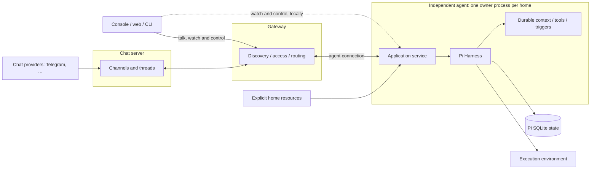

# 🦐 Pi Durable Replacement Plan

Updated: 2026-10-05
Status: experience decisions reviewed on 2026-10-03. [Where it stands](#where-it-stands) says what is built, and the plan was reshaped around the core pieces on 2026-10-05. The new Shrimpy is the repo's root on `wip`, and old Shrimpy is in `shrimpy-old/`. Two lists keep the build honest: what the build introduced that [you haven't reviewed](AUTHOR-TO-REVIEW.md), and where the code [trails this plan](STATUS.md#where-the-code-trails-the-plan). A few interface and command details are left for the phases that build them.

Shrimpy's session machinery gets replaced with `pi-durable`. Each agent becomes an independent program: one resident process owns its home and its Pi storage. People talk to agents in threads kept by a chat server, from the console, the web app or chat providers such as Telegram, and clients can attach to an agent to watch and steer its work. Pi owns admission, queues, transcripts, task lifetimes, cancellation, compaction, recovery and committed observation. Shrimpy owns the home, the agent's context and tools, the clients, and the routes in.

The aim is fewer state machines, clearer ownership, and a smaller, better organized codebase. Switching engines doesn't license quiet changes to how people or agents use Shrimpy: every visible change is listed under [experience decisions](#the-core).

This file owns the architecture, experience decisions and phases for this change, and [STATUS.md](STATUS.md) logs progress. The [Pi research note](../research/pi-agent.md#pi-durable-source-and-recovery-investigation) owns upstream findings and probes. [Reference docs](../../shrimpy-old/docs/reference/README.md) describe what ships today.

## Why

Old Shrimpy's shape was discovered, not designed. It found good UX along the way and mostly works. This redesign keeps that UX and changes two things the old shape can't reach:

- **Agents everywhere.** Old Shrimpy needs its agents to share one runtime and one environment. The goal is lots of weird little agent friends on compute nearby and afar, united in Shrimpy land: each runs where it makes sense and networks to a gateway.
- **An intentional shape.** The code should be small, in distinct separate pieces with clear separation of concerns. LLM agents do most of the development, and they handle monoliths badly.

Four more reasons shape the design:

- Opening a terminal or web app and jumping into any agent's sessions is core UX. Staying coupled to Pi's terminal app prevents it.
- Pi's developers have more time for runtime architecture than Shrimpy does, so Shrimpy reshapes around their durable runtime.
- Keep it shrimple: rely on agents and Markdown where possible, and don't invent every wheel.
- Agents use chat rooms the way people do, and the end game is a real chat app.

## Direction

Confirmed during review:

- **Agents run independently.** Each agent runs in its own process, outside any gateway, and keeps working when clients or the gateway go away.
- **Every conversation is a thread in a channel.** A channel is a place: a DM with an agent, or a room with people and agents. It has a main thread, and side threads hold parallel topics. The console, the web app, Telegram and a future desktop app are all clients of channels; there's no separate way of talking to an agent from the console.
- **Sessions sit behind threads.** Each agent taking part in a thread keeps one current session for it: its private work. Work with no thread, such as a helper's, has a session too. Opening the terminal or web app, picking an authorized agent and entering any of its sessions to watch, steer or stop it is core UX, locally or through a gateway.
- **A chat server keeps channels.** It's a service of its own that holds channels with their threads, messages and attachments, and bridges chat providers in: the shared record of what was said. Agents keep their sessions, their own private work. That's the split between channels and sessions Shrimpy has today.
- **The gateway only connects things.** It handles discovery, access and routing between clients, agents and the chat server, and keeps the workspace's configuration: registrations, tokens and workspace context. It never hosts agents or conversations. A gateway on Tailscale is the leading option for network identity and security.
- **Shrimpy leaves Pi's terminal app.** Shrimpy owns its session-client contract and presentation, reusing public `pi-tui` components where they fit.
- **Pi's durable runtime is the engine.** Shrimpy reshapes around it instead of wrapping it.
- **Chat providers are interchangeable.** Telegram is one chat provider among possible others, such as Discord or iMessage. Shrimpy's chat behavior lives in the chat server, and each provider only translates its own API. A desktop chat app, possibly a fork Shrimpy maintains someday, would plug in the same way; it isn't part of this plan.
- **Agents decide what wakes them.** The chat server offers each new channel message to member agents, and each agent's wake policy decides whether it starts a turn, as `channelPolicy` does today. By default an agent wakes for DMs, for mentions and for a person's message in a room that mentions nobody, and an included skill teaches agents to tune their own policy. Loop protection lives there too; nothing upstream filters conversation.
- **Sandboxing is a deployment choice.** An agent runs the same with or without a sandbox. When it is sandboxed, the sandbox wraps the whole agent process. Shrimpy doesn't sandbox individual tools, so agents keep a real shell.

This direction comes from the `REDESIGN` branch (2026-09-19): independent agent homes, a front door on Tailscale, one API for every client, and skills in place of subsystems. Its contracts built on Pi's `AgentSession` and its `shrimpy2/` scaffold are superseded here. It differs in one place: triggers, today's watches, stay in the agent's runtime instead of moving to OS schedulers ([see below](#what-an-agent-does-without-being-asked)).

## Words

| Word | Means here |
|---|---|
| Agent | An enduring identity with its own home. Pi uses "agent" for the configuration a conversation runs with. |
| Channel | A place where people and agents talk, such as a DM or a room, kept by the chat server. |
| Thread | One conversation inside a channel. Every channel has a main thread. |
| Session | An agent's private work behind a thread, or behind work with no thread. Pi calls this a conversation. |
| Helper | A child session an agent starts to split up its own work. Pi calls these subagents. |
| Trigger | Anything other than a message that wakes an agent: a time, an interval or a check whose output changed. Today's watches. |
| Breadcrumb | A fact that comes with an agent's next input, once, when it is new to that session. It is one small file in the agent's home. |
| Chat provider | A bridge between a channel and an outside chat app, such as Telegram. |
| Chat server | Keeps channels, threads, messages and attachments, and bridges chat providers in. |
| Gateway | Connects clients, agents and the chat server, and keeps the workspace's configuration. It never hosts agents or conversations. |
| Workspace context | The shared `context/` files every agent reads, hosted by the gateway. |
| Member | A person or an agent on the network. It has an ID that never changes and means nothing, and a name that can change. |
| Roster | The gateway's list of every member, with how each is recognized and who is reachable now. |
| Ticket | What the gateway gives a client to hand to a program, so the program can ask the gateway who the client is. Single-use, short-lived and good for that program only. |
| Route | Where Pi's server sends a connection that asks to watch something: a thread on the chat server, a session on an agent. Pi calls it a session. |

## Where it stands

As of 2026-10-05.

| Piece | Built | Building | Next |
|---|---|---|---|
| The three programs | The agent, the chat server and the gateway run as separate programs, and `shrimpy up` starts them. An agent has one live body. | A review of how the agent's own code is divided. | Reshaping the agent's modules by job. |
| The contracts | The agent's, the chat server's and the gateway's contracts, with refusals that say which case they are. | — | Carry only Shrimpy's shapes: Pi's error types still show through. |
| Identity and addressing | The roster, member IDs, names, tickets, reaching a program by its name, and who may do what, with one role, admin. | — | Removing a member, replacing a token, renaming a person. |
| The conversation model | The feed of events, receipts, rooms, mentions, wake policies, the backlog an agent reads, an answer waking whoever asked, and one task following every input. | — | The provider interface with a fake provider. Ways in for edits, deletes and reactions. |
| The home | The files an agent is told from, skills, reload, `triggers/`, `wake.json`, and records with an ID of their own. | — | Breadcrumbs. Compaction with Shrimpy's guidance. Seeing the request a turn sent. Workspace context from the gateway. |
| The network | On one machine: every connection by name goes through the gateway. | — | Another machine, sandboxes, Linux and Tailscale, which wait for a machine to test on. |
| What an agent does without being asked | `check_back`, standing triggers and their commands. | — | Checks and breadcrumbs. Asking another agent. Helpers. |
| Using it | The terminal, which browses agents and rooms, the commands, and a default folder, `~/shrimpy`. | — | What daily use asks for: resetting a session, `/new` and `/stop`, sign-in, the web client. |

## The core

Each row has a decision status:

- **Keep:** the outcome stays the same. Its phase still has to prove it.
- **Change:** a recommendation waiting for your call.
- **Confirmed:** decided in review.
- **Open:** not decided yet.
- **Decided in the build:** a small mechanic the build settled under [core first](#order-of-work). Say so if you want it otherwise.

If implementation finds another visible difference, add a row before shipping it. That covers tool text and results, prompts, defaults, keys, command names, JSON, context, lifetime, retention, delivery, timing and cost. A prototype may skip features to answer a narrow question, but it must list what it skipped. Live cutover needs every affected capability kept or explicitly changed.

### The three programs and what each owns

An agent owns one home and its private work, the chat server owns the shared record of what was said, and the gateway owns who is on the network and how to reach them. They share only contracts.

**The design**



The host builds the model and credential runtime, the trusted durable registry, the environment resolver, SQLite storage and the service, then supervises them. Opening a home's storage changes it, because durable resets unfinished work on every open. The phase 0 spike saw a second process that only opened a live home flip the owner's running turn back to pending, and a second owner send a model request twice and corrupt the first owner's session. So only the owner ever opens a home's storage, and commands that read a home's sessions go through the owner's API. The owner takes an exclusive lock on the home before anything that writes or serves, meaning opening storage, starting servers or binding sockets, and holds it for its lifetime. Reading the home's files comes first, so a home that doesn't load or names an unusable model fails without claiming it. The spike's 21-line lock on `node:sqlite` works on macOS; Linux is qualified with the pieces that cross machines.

Pi owns submissions, `InboxDoc`, `LiveDoc`, `UsageDoc`, conversation entries and configuration, generation, tool and compaction tasks, checkpoints, child ownership and structural watches. Shrimpy reads them directly. Query indexes and UI caches are disposable and name their source.

Shrimpy's own documents hold only what Pi lacks: the thread each session belongs to; immutable source and target provenance; context-source evidence; chat and trigger receipts and policy; where the agent stands in chat's feed; and an ID for the records themselves. A reply waiting to be posted isn't among them: the task that follows its event holds it. Thread names and archive state live with the threads on the chat server. They are written through Harness commits. Pi's statuses are never copied into them.

The host gives each session an `ExecutionEnv`. Replayable operations need a stable resource and cwd identity. Extension code is trusted host code and can bypass the environment, and process cleanup is a separate guarantee from containment.

- **Unsafe by default.** Every built-in durable tool is unsafe; writes, edits, shell commands and unqualified sends stay that way. A custom `safe` declaration needs a stable target and proven deduplication by task or call ID. Deduplicating accepted sends still isn't exactly-once delivery, so uncertain results stay visible.
- **Ownership.** Foreground ownership controls joins and abort; background ownership is explicit. A client disconnect, navigation or cancelled wait never aborts accepted work. Abort reports done only after cancellation settles. Controls never hold a transaction while waiting on their own running turn.
- **Supervision.** Shutdown is bounded and accounts for tool descendants. Cooperative abort kills owned process groups, but killing the owner can leave detached processes running. Prove cleanup with a delayed-write child under the chosen supervisor before advertising it. If that can't be guaranteed, show possible continuing effects and flag the limit for review.
- **Storage.** SQLite in WAL/NORMAL mode survives process crashes, not power loss. Back up from stopped snapshots that include the WAL. Pin Pi's package and task contracts. Before opening admission, the host checks extensions and pending task definitions and names affected sessions on failure, because Pi alone may drop a missing extension or block single tasks. The host installs Shrimpy's extensions after it opens storage and before it resumes work, since what posts to chat is made from the ID of the records. Pi advises installing before the open so recovered work can resume at once; here nothing runs until the host resumes, and this check runs after the install. Upgrading pending work needs compatible definitions or a reviewed disposition.
- Keep the durable, AI, Chord, server, client and protocol packages pinned at `1.0.0`, and pin `pi-tui` the same way when the terminal client arrives. Use public exports only.

The gateway handles discovery, access and routing between clients, agents and the chat server. It keeps the roster, with each member's name and how it is recognized, and the workspace context. It never holds agent homes, Pi storage, execution or conversations, and it reaches agents' sessions only through their API. Losing the gateway pauses chat and remote access but never stops an agent. Watching and controlling an agent on its own machine works without a gateway; talking needs the gateway and the chat server, and on a single machine both run locally.

**Decisions**

| Topic | Today | Proposed | Decision |
|---|---|---|---|
| Stopping and cancelling | — | Service stop halts execution and keeps records; restart follows the [recovery](#the-conversation-model) rules. Cancelling work is a separate action, scoped to one session or the whole home, and the three controls are labelled so they can't be confused. Shutdown stops taking new work, gives running turns a short timeout to finish, then pauses the rest; `--now` skips the wait. | Confirmed |
| `shrimpy up` and what it started | — | It stops everything it started when any one of them ends, an agent or the gateway. Closing the terminal leaves the programs running. | Confirmed. Programs started on their own, with `agent serve`, `gateway serve` and `chat serve`, don't share a fate: losing the gateway never stops such an agent. |
| A copied home | — | A home copied with its token was the same agent twice: two live connections with one member, and nothing chose between them. | Changed, and built on 2026-10-04. An agent has one live body. While it runs, the gateway turns away a program that joins with its token, signs in with it under another name or registers as it, and renames nothing. The gateway says what happened; the agent, which knows its home, says how to make a copy an agent of its own, once, while it keeps trying. A copy takes the agent's place once the first one stops, since a copied token is the same agent. |

**Open**

Qualifying the programs and their locks on Linux is under Later in the [order of work](#order-of-work).

### The contracts between them

A contract says what a message, a session view and a registration are. Agents on other machines, other versions and other clients depend on these.

**The design**

Clients use two APIs, each the same for local and gateway-routed use. The chat server's API covers channels, threads, members, posting and reading messages with their attachments, and subscriptions. Each agent's API is a set of concrete operations:

- session inspection and selection
- reset, fork, steer, status, wait, withdraw and stop
- model, thinking, defaults and reload
- provider login, relaying Pi's login prompts to the person's client
- raw and effective context, entry queries and committed subscriptions
- completion against the agent's filesystem
- publication and chat-provider status, trigger and delegation controls
- receiving the attachments of offered messages into the agent's home

Commands, clients and tools call the same operations. Which of them get a command follows the [rule for commands](#using-it). For transport, use `pi-server`, `pi-client` and `pi-protocol` over a restricted local Unix socket first, where their public APIs fit. Coding-agent's experimental controller isn't reused wholesale because it drops durable request IDs. Pi's protocol carries everything Shrimpy ships: the console, the web client, the CLI, the chat server, and each agent's link to the gateway. Plain HTTP is added only when a program that can't speak Pi's protocol needs in, and not yet. Only a Unix socket transport ships, so the web client needs a small WebSocket bridge; the spike's was 69 lines. Sockets live in a short runtime directory, because macOS caps Unix socket paths at 104 bytes. `pi-client` never reconnects on its own, so clients reconnect with backoff and mark a disconnected view as stale. The browser bundle is about 200 KB minified and 53 KB gzipped, mostly TypeBox. The protocol makes no compatibility promises, so Shrimpy pins Pi exactly, agents and clients upgrade together, and a version mismatch between peers is reported clearly.

Contracts carry Shrimpy-owned shapes only: the agent builds the session view that clients draw, so no client depends on Pi's record types. Clients talk through threads and watch through sessions. Attaching straight to an agent covers watching, steering and stopping, including while the gateway is down. Clients render committed views. Help, status and editor state stay local and never enter the transcript. Completion and shell input run against the agent's paths, never the client's cwd, so an attached console asks the agent for completions instead of reading a local directory. Clipboard files and images attach to the message you send, like any other attachment, with provenance and size limits.

**Decisions**

None.

**Open**

**Decide first:** how peers stay compatible across machines. Pi's protocol makes no compatibility promises, so every program upgrades together today. That works on one machine. With agents on other machines, updating one side breaks every agent that hasn't updated yet. The link that crosses machines is small: an agent talking to chat and the gateway. Either that link gets a stable protocol of its own, or lockstep upgrades are accepted with a clear report of the mismatch. The MVP takes the second: every program runs the same version, and a mismatch is reported.

### Identity and addressing

It covers who a member is, how something is named and found, and who may message, watch, control or administer.

**The design**

Homes under one OS user share that user's authority. Different permissions need a real OS environment boundary; a session, a home directory or a tool selection isn't one. Remote access distinguishes permission to message, observe, control and administer.

**Who may do what, confirmed on 2026-10-05** as good enough for now, and not built yet. You asked for it to be settled with rooms. The plumbing is built: every request that comes through the gateway carries who is asking, every operation of an agent's API already asks a check, and that check says yes to everyone.

1. **One role: admin.** A member is an admin or isn't, and the roster records it. You are one. An agent is one when you say so.
2. **What needs an admin:** making a room, adding members to one, and watching or controlling another agent's sessions and triggers. Later, renaming or removing a member and replacing a token.
3. **What never does:** talking. Any member posts in the channels it is in and starts a DM with anyone. An agent watches and controls itself. You do anything.
4. **The program that is asked checks,** as now: the chat server for rooms, an agent for its sessions and triggers, the gateway for the roster. The four permissions stay the names of what an operation needs: message, watch, control and administer.
5. **In an agent's shell, a command about another agent goes through the gateway as that agent,** so the other agent can refuse. Today such a command goes straight to the other home's socket, where the caller counts as the home's owner.
6. **It stops accidents, not attacks,** until agents run in sandboxes. On one machine under one OS user an agent with a shell can read another home's token or edit the roster's file. It becomes a wall when an agent runs in a sandbox whose only way out is the gateway.
7. **Commands:** `shrimpy members` lists the roster with who is an admin, and `members promote <name>` and `members demote <name>` change it. Only you and admins run the last two.

This changes one line of the rooms design, where any member could make a room: an admin can.

**Decisions**

The thinnest of the [core pieces](#the-core). The first column is what the new Shrimpy does today, on one machine with one person. Three rows were sharpened by a second opinion from another model, and all but the last two were confirmed on 2026-10-04. They are built before rooms: the roster and IDs first, then the feed of events, then connecting to a name. The first was built on 2026-10-04, so the "built today" column describes what it replaced.

| Topic | Built today | Proposed | Decision |
|---|---|---|---|
| Who exists | The gateway lists the programs connected right now and forgets one when it disconnects. The chat server remembers whoever has identified. Nothing answers "who can I talk to", so an agent can't start a DM and the terminal lists only running agents. | The gateway keeps a roster: every member of the network, person or agent, with its name and how it is recognized. It survives restarts and says who is reachable now. It is the one list that clients and agents read to find someone. The chat server keeps which members are in which channel, by the roster's IDs. | Confirmed |
| Names | An agent's ID is `agent:<name>`, so the name is the identity: a renamed agent is a new member, and a new agent with an old name inherits its DMs, receipts and cursors. Of two agents with one name, the newest is reached. A person and an agent can share a name. | A member's ID is minted once, means nothing and never changes. Its name is a label the roster binds to that ID: one set of names covers people and agents, so `@name` always means one member, and a name can change without the member becoming someone else. A second claim to a name in use is refused. IDs are written into every message, receipt and cursor in the chat store, which is why this is decided before rooms. | Confirmed |
| How a member is recognized | A connection says who it is and is believed. | A connection never says who it is; the gateway decides. One that presents an agent's token is that agent, on this machine or another. One without a token, on the gateway's own socket, is the OS user's person. From another machine a person is their Tailscale login. An agent's home makes its token, keeps it, and joins with it. Its launcher tells the agent's shell which home it is, and a command run there reads the token from the home, so the token never sits in the environment. A program learns who is on a connection from the gateway, by a ticket, so `identify` goes, and every chat connection comes through the gateway, on one machine too. A copied home holds the same token, so it is the same agent, and an agent has one live body: while it runs, the gateway turns the copy away. Under one OS user this stops accidents, not attacks, as the plan already accepts. | Confirmed |
| Reaching a program | The gateway hands out each program's socket path and pid, and a client on the same machine connects to it directly. Reaching an agent on another machine would be a second path. | One call: connect to a name. A connection made by name always goes through the gateway, on one machine too, so the path that agents on other machines depend on is the one used every day. Clients never see a socket or a pid. A connection made by a home's path goes straight to that agent's socket, which is how an agent is watched and stopped while the gateway is down. A request that goes through the gateway carries who is asking, and the agent enforces what they may do. | Confirmed |
| Who the CLI speaks as | The person, whoever runs it. An agent that runs `shrimpy run` posts as its owner, and can't read its own threads with `threads` or `read`. | In an agent's shell the CLI speaks as that agent: the launcher that puts `shrimpy` on its path also says who is running it. In a person's terminal it speaks as the person. Then an agent can read its own threads and talk from a script, and can't post as its owner by accident. | Confirmed |
| How the gateway vouches | Nothing vouches: a connection says who it is. | With a ticket. A client asks the gateway to connect it to a name and gets a ticket. It connects through the gateway, hands the ticket to the program, and the program asks the gateway whose it is. Nobody says who they are, an agent's token is shown only to the gateway, and nothing is parsed ahead of Pi's protocol. | Confirmed |
| A page in a browser | A page can list the programs and the roster and nothing more, so it can't reach the chat server or an agent. | A page served by the gateway on this machine is the person who runs the gateway, with everything that person may do: whoever can use the web app is the admin. It gets in with a link that carries a secret only that OS user can read, so another account on the same machine can't open the page and be them. From another device it waits for Tailscale. Built with the web client. | Confirmed |
| Who may do what | Everyone under the OS user can do everything. | The four permissions (message, watch, control, administer) are enforced by the program that is asked: an agent for its sessions, the chat server for its channels. The gateway only says who is asking and pipes the bytes. A connection by a home's path is the home's owner, and the OS guards that socket. Built so far: an agent learns who is asking on every connection that comes through the gateway, and its check lets everyone do everything. Which member gets which permission isn't modelled until there is a second person. | Change |

| Topic | Today | Proposed | Decision |
|---|---|---|---|
| Identifiers | Path-shaped session IDs | Channels, threads and sessions get short, stable IDs, and channels and threads have names you can change. A session is identified by its agent and thread: its address at the agent is the thread's ID, so a client looking at a thread opens the work behind it with the same ID. There's no main session. A session behind no thread has an address of its own: a trigger's own session is `trigger:<name>`. A new thread shows its first message until it's named. CLI JSON, search hits, anchors, URLs and copied links change. Choose a form that can gain a machine prefix later. | Confirmed |
| Agent identity at the gateway | — | People's devices are identified by Tailscale, so clients need no Shrimpy login. Each agent gets a token from the gateway when it's registered and presents it when it connects, and the gateway checks that the connection comes from the expected machine. An agent on the gateway's own machine connects locally, where socket permissions make that check. Giving an agent its own tailnet node, with Tailscale running inside its sandbox, stays optional. | Confirmed |
| Your name | — | The person is made when the gateway starts, from the OS user, and is named for it. Nothing renames a person, and a person is never shown as reachable. | Kept for now. The name you appear under becomes one of your own settings later. |

**Open**

Who may do what is under Now in the [order of work](#order-of-work). Your own settings as a person are under Later.

### The conversation model

It covers channels, threads, a session behind each thread, receipts, and how an agent decides to wake and answer.

**The design**

The chat server is a service of its own, with its own store, so the gateway doesn't grow into one big service. It owns what channels share: threads, message logs, membership and access, attachments, addressing and mentions, reactions and edits, who is working, and delivery receipts. Each chat provider runs inside it and translates one outside app: authentication, polling or webhooks, sender mapping, merging bursts and albums, formatting and splitting, typing, and mirroring into the bridged chat. Providers share helpers for what they have in common. Chat commands aren't the chat server's: a command is a message, and the agent it addresses acts on it. Code outside a provider's own directory doesn't depend on which provider it is.

- **Storage.** SQLite through Node's built-in `node:sqlite`, like the agents, with the chat server as its only writer. A message, its batch membership, its attachment references and the provider cursor that delivered it commit together. Attachments are files next to the database. The store is user data, so back it up like a home, from a stopped snapshot or with SQLite's backup.
- **Offers.** An agent is a member like any other. It connects out to the chat server, through the gateway when they're on different machines, and asks for the events after its own cursor. The chat server never has to reach an agent, and an agent that was down catches up from where it stopped. One with no cursor reads its channels from the start and passes over events that already carry its receipt, so a message sent before an agent first connected is still answered. Each agent's wake policy decides whether an event starts a turn, and the agent keeps one session for each thread it takes part in.
- **Identity.** A connection hands the chat server a ticket before anything else, and the chat server asks the gateway whose it is. Nobody says who they are. A member's ID never changes, and its name is the roster's and can.
- **Unread messages.** Each agent keeps a bounded copy of the messages it was offered, including ones that didn't wake it. It's a disposable cache whose source is the chat server. A turn's unread messages come from that copy, so they're captured when the message is consumed and still available while chat is unreachable. `read_messages` asks the chat server for anything older.
- **Providers.** A provider gets five things from the chat server and nothing else: it posts for the people it maps, keyed by the outside message's ID; reads its bound threads from its own cursor; reports delivery; moves attachments; and sees who is working. That's a slice of the chat API, so a provider starts inside the chat server's process and can run on another machine later, as Signal and iMessage need. The [chat bridge scout](../research/chat-bridge-scout-2026-10-03.md) found nothing to adopt in place of this interface.
- **Receipts.** An event carries what each agent did with it: answered, silent, stopped, skipped or failed. The agent reports it when its turn settles, after any reply is posted. A message shows the receipts of its events. Leaving a receipt is itself an event in the log, so anyone following the feed learns of it, and a receipt can't be left on one.
- **The log.** Every change to a message is an event with a position and an ID of its own, written in the same transaction as what it changes. Positions give the order and the cursor. IDs are what an agent admits by, because a replaced store starts its positions again. A delete empties the text of that message's events too.
- **Not everything is rendered.** A thread holds data for whoever asks. What a client draws, what an agent is shown and what a provider sends to an outside app are each a selection from it, and some of it stays invisible by default.
- **Who is working.** Each thread carries who is working in it and since when. An agent reports it over its own connection, so the mark ends with the connection and a crashed agent never looks busy. It isn't stored and it isn't a message.

Every incoming operation carries an authenticated source, a stable event or request ID, immutable payload and attachment references, and a target home. Its session comes from the thread it belongs to, or an explicit session ID for steering and control, never from a model call.

A request ID names one request, and its first use wins. Pi returns the first submission when an ID is reused, even with different content. The chat server keeps a digest of the first request, since the message itself can be edited or deleted later, so it returns that message for a true retry and refuses an ID reused for a different thread or text. Edits, deletes and reactions carry no request ID yet: a repeat that would change nothing writes nothing. Shrimpy keeps no receipt of its own to compare content. A session never changes its thread and a reset stays inside its session, so a retry always lands in the same place. Pi's submission stays the only execution and settlement record.

An event is taken up in one commit and followed by one task:

1. One Harness commit moves the feed's cursor past the event, makes the thread's session if it's new, and creates a Pi background task for the event.
2. The task calls public `Conversation.submit()` with the stable request ID. It first hands over any earlier input of its session that hasn't been, so inputs reach a session in the order they were admitted, whatever order Pi starts the tasks in. For chat events that is the feed's order.
3. The task waits for the input to settle, posts the reply, leaves the receipt and ends.

A crash at any point leaves a task, and Pi resumes it at its checkpoint. The feed is never read again for an event already taken up, because the cursor moved with the task. Use only public APIs: no `submit()` inside a Harness commit, no private admission helpers and no raw `Tx.createSubmission()`.

- **Channel messages:** the chat server stores each message, or burst batch, before advancing a provider's cursor, then offers it to member agents. An agent admits an event using the event's ID as the request ID, so a retry can't duplicate it or regroup a batch.
- **Replies:** the task that follows an event is the record of it until its receipt is left. It posts the reply when the turn settles and waits while chat is away, and after a restart Pi resumes it where it was. A reply's request ID is made from the ID of the agent's records, its thread and its answer. So a retry can't post twice, several events answered by one turn get one reply, and a fresh set of records can't repeat an ID that an earlier set used. A failure inside the task becomes a failed receipt with the reason. Who is working, and what a stop waits for, are read from Pi's list of tasks.
- **Other sources:** the task that follows a chat event follows an input from any source: a trigger's occurrence, a wake-up the agent asked for, or another agent's answer. Each hands its input over in order, posts the final text to the session's thread if it has one, and tells its source how the turn ended. Trigger occurrences and steering input use their own source namespaces. Transport and status correlation numbers aren't deduplication IDs.
- **Control changes:** creating or forking a session commits it together with its thread binding. Reset is a `write` submission containing a `ResetEntry` and a request ID. Thread names and archive state are versioned set-to-value updates, so an old retry can't overwrite a later decision. Default and resource saves return a version or require a re-read after a lost acknowledgment. Clients never retry a change automatically without such a rule.

**Design, confirmed on 2026-10-04,** and changed on 2026-10-05 by what the first demo with two agents showed. Agents planning by DM is fine and nothing steers them away from it: what changes is that a session behind a DM can post in the room. With two changes you made at first: rooms are made with a command that agents run too, and the backlog an agent is shown is larger and says when there is more. The rest fills the gaps around the rows on [wake policy, chat behavior and the feed](#the-conversation-model).

1. **A room** is a channel with a name and any number of members, people and agents. Any member can make one and add anyone on the roster. Leaving and removing wait until someone needs them. Only members read and post. Nothing gates who talks to whom inside your network. A room is made with a command, `shrimpy rooms new <name> [<member>...]`, and members are added with `shrimpy rooms add`. Anyone runs them, an agent from its shell included, so you can ask an agent to make a room. The terminal only browses rooms.
2. **Who a message is for.** In a room a post is addressed to the members it mentions with `@name`, and `@all` addresses everyone there. In a DM it stays the other member. An answer also wakes whoever asked: when a message of an agent's that mentioned someone gets an answered receipt from them, the agent is woken with the reply. That is one hop. Anything after it takes an `@mention`, so two agents can't keep waking each other by answering. This replaced, on 2026-10-05, a reply being addressed to whoever wrote what it answers, which couldn't hold when one reply answers several messages.
3. **What wakes an agent** stays its own call. The default is `people`, decided on 2026-10-05 after the first demo: a person's message that mentions nobody wakes every agent in the room, and any other message wakes only who it mentions. So does an answer to a message of the agent's own, an edit of what woke it, and a reaction to a message it wrote. An agent is told to answer a person's message that mentions nobody only when it is its to answer, and otherwise to end with `END`. An agent sets a room to `none`, `mentions`, `people` or `all` with one command, `shrimpy wake <room> <policy>`, which a skill teaches, and the choice is kept in a small file in its home.
4. **What an agent reads when it wakes in a room:** the thread's messages since it last looked, as written, oldest first, with who said what, when, and whether it was addressed to the agent. The backlog is cut at 20,000 characters, keeping the newest, and a cut says how many earlier messages there are and that `read_messages` reads them. The agent reads them from chat when it takes the event up, since it is connected then, and keeps only where it last looked in each thread.
5. **Winding down is the agents' job.** Neither the chat server nor the gateway has loop rules: there is the default policy, instructions against banter, and `END`. The proof is two agents in a room on the small local model, given something that needs both, finishing without going round in circles. If instructions can't stop a loop there, that comes back to you before any mechanism is added.
6. **Providers.** The interface gives a provider the five things the [chat server](#the-conversation-model) section lists. A fake provider is built first and proves them: posting for a person it maps, keyed by the outside message's ID; edits, deletes and reactions that carry a request ID, so a replayed old one can't undo a newer one; and acting for the person it maps. That settles what the feed of events left open. Telegram itself comes later, with the pieces that cross machines.
7. **Order of building:** rooms in the chat server and the contract, with the commands that make one and the terminal browsing them; then the wake policy, the unread copy and the message tools' room addresses in the agent; then the two-agent proof; then the provider interface with the fake provider.

**Decisions**

| Topic | Today | Proposed | Decision |
|---|---|---|---|
| Working contexts | One session per agent for each chat or binding | One session per agent for each thread it takes part in, with its own history and model settings and the home's shared resources. No master session and no shared transcripts. A new thread isn't a new agent or a filesystem boundary. | Confirmed |
| New, reset, archive, resume | New and restore wait behind running work and swap JSONL files | A new topic is a new thread, and the old one stays to come back to. Reset clears the agent's context for a thread, while the thread's messages and the agent's earlier work stay browsable; a chat app without threads, like a Telegram private chat, uses reset for `/new` as today. Archive hides a thread without deleting it, and resume reopens one. A new thread starts at once, even while the agent is busy, because an agent runs its sessions side by side, and late replies in the earlier thread still arrive there. | Confirmed |
| Old history | JSONL transcripts | Shrimpy converts nothing. Old transcripts stay in the old workspace, and each agent brings over whatever it wants from there itself. Channel logs aren't carried over, so new channels start empty. | Confirmed |
| Busy external input | Queues as a follow-up; Telegram groups bursts | It waits for the next turn, with one exception you chose on 2026-10-05: a person's message that mentions the agent, by `@name` or `@all`, joins the turn that is running, and the model reads it at its next step. In a DM, where every message is for the agent anyway, a mention is how a person says it can't wait. An agent's message waits whether or not it mentions anyone. Burst grouping is shared by every chat provider. | Confirmed |
| Stop | Stops the current run; queued turns stay | Pi's abort cancels the session's current work, withdraws messages still waiting for the agent and aborts foreground children. Those messages stay in the thread, marked as skipped, and the agent sees them as unread the next time it wakes. | Confirmed |
| Completion | Inferred from the first `agent_end` | Submission settlement. Accepted, queued, running, answered, unanswered and cancelled are distinct, and an interrupted tool inside an answered submission shows both facts. `shrimpy run` waits for settlement and exits 0 when answered, including an agent that stays silent with `END` and prints nothing; 1 when it failed or ended without an answer; and 130 when cancelled. `--no-wait` returns once the message is accepted, with an ID to wait on. | Confirmed |
| Recovery after a crash | — | Visible, not seamless. A partial model stream is kept as aborted and the request is sent again, which may cost again. An unsafe tool is reported as interrupted and isn't replayed. External processes may have kept running. Show a notice and keep diagnostics. Unfinished work resumes automatically, but a turn that has been resumed and crashed twice is stopped, marked failed and explained. Only an unclean end counts as a crash: stopping and starting the agent in an orderly way during a turn never does. | Confirmed |
| Publication rule | Assistant text in channel conversations is private; only tools publish | A turn's final assistant text goes to the thread its message came from, unless it's `END` or empty. It posts even when the turn already sent messages through a tool. Text earlier in the turn stays private, and so does the final text of work with no thread, such as a helper's. Many models forget to call a reply tool, so replying becomes the default, and `END` lets an agent stay silent, which also stops polite goodbye loops. `END` still counts when it's wrapped in whitespace, quotes, backticks or asterisks, or ends with a period, and text followed by a last line of `END` posts without that line. Messages sent mid-turn or elsewhere use the [message tools](#the-conversation-model). | Confirmed |
| Message tools | `reply`, `ask`, `notify`, `report`, `send_message({channel, text})` and `read_channel({channel, limit?})`. The first four only differ in a label nothing acts on, except that `quiet` or low-urgency `notify` delivers silently on Telegram; `batchable` is stored but unused. | Two tools. `send_message({text, to?, quiet?})` posts to this thread when `to` is omitted, or to `@agent` or `@person` for a DM, `#channel` for its main thread, or `#channel/thread`. A person is reached where they were last active, as `user:<id>` does today. `read_messages({from?, limit?, before?})` reads with the same addresses, defaulting to this thread. The final-text default covers what `reply`, `ask` and `report` did, and `quiet` covers `notify`. For example, `notify(text, urgency="low")` becomes `send_message(text, quiet: true)`, `send_message(channel="dm~mechanic~shrimpy", text)` becomes `send_message(text, to: "@mechanic")`, and `read_channel(channel)` becomes `read_messages(from: "#channel")`. Reactions and edits add `react({emoji, to?})`, which defaults to the message that woke the turn, and an `edit` option on `send_message` for one of the agent's own messages. | Confirmed |
| Publication results | — | Success means the delivery owner accepted it. Pending, delivered, failed and uncertain are a separate status. A person's last-active destination is fixed when the message is accepted. A message that was accepted but later fails or becomes uncertain is noted in the agent's next turn, so it can fix and resend. | Confirmed |
| Publishing while chat is unreachable | Replies append to the channel log on disk, and the gateway's outbox delivers them when it runs | The agent tracks whether it's connected. Publication tools fail with an explanation the model can act on: not sent because chat is unreachable, so try again later. A send that went out without confirmation reports itself as uncertain. Each publication carries its tool call's ID, so a retry never posts twice. A final reply has no turn left to tell, so the task that follows its event holds it and posts it, once, when chat is reachable again. A reply whose turn finished just before a crash is delivered the same way, because Pi resumes the task. A reply the chat server refuses for good, such as one to a channel the agent has left, is dropped with a diagnostic, and its event gets a failed receipt saying the reply couldn't be posted, where chat will take one. | Confirmed |
| No-reply watchdog | An extra model call after silent human turns, which may inject a prompt | Removed. Sending the final message by default covers what it was for. | Confirmed |
| Codemode | Not enabled | A later experiment, once the core tools work: a durable tool wrapping the standalone `pi-codemode` package. The model writes a short script that calls the agent's other tools in parallel, and only the script's output enters context. Nested calls get the same validation and tool policy as direct calls and show up in clients. Its small store lives in a session document. A crash mid-script reports the whole script as interrupted. MCP through the standalone `pi-mcp` package would build on it later. | Confirmed |
| File tools | `read` (with images), `write`, `edit`, `bash`, `grep`, `find`, `ls` | Same surface. Durable is multimodal: input and tool results can carry images. Its stock tools are `read`, `write`, `edit` and `bash`, and its `read` refuses an image file ("reading images is not supported"), so a focused tool that shows the model an image file, and focused `grep`, `find` and `ls`, come back when they're missed. Until then the shell covers search, and a picture that comes with a message [needs no tool](#the-conversation-model); the image tool is for one that didn't, such as a screenshot the agent took. Side-effect tools stay unsafe. | Keep |
| Pi extensions and themes | Discovered trusted extensions add tools, commands and renderers | Shrimpy's four bundled extensions become console features, and its theme carries over if the console reuses `pi-tui` theming. Pi's extension and package discovery is dropped, since durable can't run those extensions. | Confirmed |
| Where channels live | JSONL logs in the shared workspace | On the chat server, which keeps their threads, logs and membership. Losing the chat server or the gateway pauses chat; agents keep working and catch up on missed messages when they reconnect. | Confirmed |
| Threads | A Telegram chat maps to one channel, with one session per agent | Every channel has a main thread, and side threads hold parallel topics. Chat apps without threads use only the main thread; Telegram topics and Discord or Slack threads map to threads. | Confirmed |
| Bridged chats | A Telegram-bound channel carries only Telegram's messages and the agent's replies | Messages typed in another client are mirrored into the bridged chat, posted by a bot in that chat and labelled with who wrote them, so everyone there sees the whole thread. | Confirmed |
| Bot accounts | One Telegram bot serves several agents, and each chat remembers which agent answers | Each agent has its own account on an outside chat app, so messaging a bot is messaging that agent, and in a group each agent speaks as itself. Agents never share an account, and the per-chat choice of agent goes away. A bridge only ever posts as a bot; it never acts as a person's own account. | Confirmed |
| Reactions, edits and deletes | Not supported | Part of every thread: any member can react to a message, and edit or delete its own. Every client shows them, agents can use them, and a provider carries them to and from an outside app wherever that app's API allows. Where it doesn't, the bridge leaves them out and emulates nothing. | Confirmed |
| Wake policy | Each agent's `channelPolicy` decides which visible messages start a turn: `all`, `mentions`, `addressed` or `none`, plus sender filters. An omitted policy means `all`, and setup gives the primary agent `all` | Owned by the agent. The default is `people`, since the first demo on 2026-10-05: an agent wakes for DMs, for messages that mention it, and for a person's message in a room that mentions nobody. Setup gives no agent `all`. An edit of such a message wakes it too, and so does a reaction to a message it wrote. An included skill explains wake policies so agents can tune their own. Loop protection stays on the agent side: wake policies, instructions against banter, and `END` to stay silent. Neither the chat server nor the gateway has loop rules. | Confirmed |
| Chat behavior | Built into the Telegram surface: chat and sender restrictions, per-thread agent selection, `/new /clear /stop /thinking /status /help`, permission-filtered help, notices, typing, formatted and chunked output, quiet notices, sender labels, 500 ms burst grouping | Sorted by owner. The agent runs chat commands: a command is a message, and the agent it addresses acts on it without a model call. The first set is `/new`, `/stop`, `/status` and `/help`. `/clear` goes, since it was an alias for `/new`, and `/thinking` waits. Each provider does its own translation, with shared helpers: allowed chats and sender mapping, merging bursts and albums, formatting and splitting, typing, quiet delivery and sender labels. The chat server keeps membership and where each person was last active. The per-chat choice of agent goes, replaced by separate bot accounts. Received messages and batch membership are recorded before processing is acknowledged. | Confirmed |
| The feed | Old Shrimpy had no edits. As built, the feed offers messages, and an agent admits a message once, by its ID, so an edited message would never reach it | The feed is a log of events with one cursor: posted, edited, deleted, reacted, a reaction taken back, and a receipt left, each naming a message. A receipt is an event so that anyone following the feed learns what an agent did with something, which is how one agent finds out that another answered its question. Reading a thread still returns its messages as they now stand. An agent admits an event, not a message, and its receipt names the event it answered. What wakes an agent is its own call. By default a post or an edit addressed to it wakes it, and so does a reaction to a message it wrote, since a thumbs-up can be the answer to its question. A delete, a reaction taken back, a reaction to someone else's message and a receipt wake nobody. This is the store's key and the admission key, which is why it is decided before rooms and providers. | Confirmed |
| Message receipts | Nothing records what an agent did with a message; a client infers it | Each agent leaves a receipt when its turn for something settles: answered, pointing at the reply; silent; stopped; skipped; or failed, with a short reason. A receipt names the event it answers, a post or an edit or a reaction, and a message shows the receipts of every event that names it. A failed turn therefore leaves a trace, and a thread never just goes quiet. Receipts are thread data, so `shrimpy run`, every client, chat providers and other agents read the same fact, and the agent's API stays about sessions. A silent receipt is recorded but shown to nobody by default, person or agent, and it's never sent to an outside chat app. | Confirmed |
| Who is working | Telegram shows typing while a turn runs; nothing else shows it | An agent tells the chat server which threads it's working in, from picking a message up until its receipt is left, and the chat server keeps who is working, and since when, with each thread. Clients show it and chat providers map it to their typing indicator. It's ordinary thread data, so other agents, status commands and later notifications can read it too. It clears when the agent disconnects. | Confirmed |
| Media | Telegram photos become local paths the read tool loads; other media is only noted as unsupported | An image goes to the model with its message, as part of the input, so the model sees it on that turn without calling a tool. A model that isn't declared as taking images gets Pi's line "(image omitted: model does not support images)" in its place. Every attachment from any provider, including images, documents, voice notes and video, also arrives as a file in the agent's home up to a size limit, delivered through the API ([attachments](#the-network)), and the message says where it is, so tools in the agent's environment can use it and the agent can find it again. An inline image stays in the session's history, and is sent again with each request, until compaction drops it, so it has a size limit of its own. Transcription stays a separate decision. | Confirmed |
| Delivery | Bounded retries, history skipped on first start, no sends to unbound destinations | Same for every provider, with recipients and batches fixed across retries. A lost send acknowledgment shows as uncertain. | Keep |
| Messages sent while an agent is busy | — | They queue, and the agent's next turn answers them together with one reply. Each gets a receipt pointing at it. A person's message that mentions the agent doesn't queue: it joins the running turn, whose reply answers it too, and if that turn fails or is stopped it gets the same receipt as the message that started it. | Confirmed |
| Edits, deletes and reactions | — | The chat server and the feed carry them, and nothing can make one yet: no command, no key in the terminal and no tool for an agent. | Fine for now. The ways in come in [what daily use asks for](#order-of-work): keys in the clients, and tools for agents. |
| A turn that fails with messages waiting | — | The waiting messages are marked skipped and shown to the agent at its next turn in that thread. Nothing runs them by itself. | Confirmed. It is what a stop does. |
| The current time | — | The model is told when each message was sent, and never what time it is now. | Confirmed |
| How a time is written | — | In UTC where a model is shown one, and in local time with no zone where `shrimpy read`, `threads` and `rooms` print one. In the first demo two agents found their times four hours apart and stopped trusting them. | Change, confirmed on 2026-10-05: one way everywhere an agent or a person reads a time, local time with its offset, such as `2026-10-05T09:00:29-04:00`. It matches `date` in an agent's shell and the default zone of a trigger's cron. Built on 2026-10-05: one function in `lib/time` writes every time a model is shown or a command prints, in the machine's zone, and `--json` keeps the times the data has. The terminal keeps its short forms. |
| A fresh start | — | An agent with no records reads its channels from the start and answers every event that doesn't carry its receipt. | Confirmed |

**Open**

The provider interface with a fake provider is under Next in the [order of work](#order-of-work). The ways in for edits, deletes and reactions are under Later.

### The home

**The design**

An agent home works on its own, with no workspace pointer, gateway or other agent; it keeps a cached copy of the workspace context. It holds identity and instructions, selected resources and skills, retained knowledge, provider credentials and defaults, and Pi storage. Joining a gateway puts the agent on its roster under a name, and the agent's token stays in its home: [identity and addressing](#identity-and-addressing) has the rest.

Proposed layout; final paths settle with setup and the CLI:

```text
agent.json
SOUL.md
context/
vault/
skills/
triggers/             one small file for each standing trigger
wake.json             what wakes the agent in each room, when it isn't the default
breadcrumbs/          one small file for each fact that moves
state/pi/auth.json
state/pi/models.json
state/member.json     the agent's token, made before it first joins
state/agent.sqlite
runtime/              disposable endpoint and log files
```

Shared resources are explicit references, never ancestor or global discovery. Development uses fresh fixture homes, and no existing user data is transformed for a proof.

A durable extension supplies base instructions, skill trails, input facts and compaction guidance. Dynamic facts are captured when input is consumed, with provenance and budgets, and committed before the request. Queued input sees the facts from when it was consumed, not when it was queued.

**Caching.** Stable text lives in prompt sections that don't change between turns: base instructions, workspace context, `SOUL.md` and skill trails. When a section's text changes, Durable adds the new text as an entry at the end of the transcript. Some of the newest models take it there and keep their cache. Every other model, which by default includes any server declared in `models.json`, gets one rebuilt system message at the front and reads the whole conversation again. So sections never embed timestamps, counters or other per-turn values. Per-turn facts such as time, sender and the thread's unread messages travel with the input entry instead. Each turn then only adds to the end of a cached prefix, and a reload that changed something costs each session at most one cache miss.

What a change to the prompt costs was checked on 2026-10-04 against Pi 1.0.0:

- A changed section is sent whole, and every file in `context/` is part of one section, so one changed file sends all of them again.
- Pi's model list lets a model take a change in place only for some of the newest models on their makers' own APIs, such as Claude Opus 5.5 and GPT-5.5.
- A server that refuses a system message unless it comes first can never take one in place. The local Qwen server is one: "System message must be at the beginning."
- A reload that changed nothing adds nothing and costs nothing.

How Pi recovers shapes these rules:

- `beforeRequest` transforms stay pure. They run again after recovery, so reading files or the clock there would change a resent request.
- Prompt sections render again too, including after blocking compaction, so they can't run external commands. Nothing runs a command to build a prompt or an input: a fact that moves is kept in a file and reaches a session as a breadcrumb.
- Throwing from a section doesn't signal failure; Pi can keep the old text and proceed.
- A reload reaches each session at its next request, as Pi renders sections, including a turn that is running. The registry, tool implementations and environment stay fixed for accepted work; replacing them needs admission to stop and a drain and restart.

Inspection shows raw entries, effective model messages, selected tools, source revisions, omissions and budgets, and the effective model and settings. Previews are labelled as previews; a captured request is the real evidence. Hidden context in the human transcript expands without blank rows.

**Decisions**

| Topic | Today | Proposed | Decision |
|---|---|---|---|
| Instruction selection | Approved base context, `SOUL.md`, agent context, skill precedence and required-tool filtering; ambient `AGENTS.md` and global Pi skills and settings excluded | Same, with the workspace's shared `context/` files coming from the gateway. Facts are captured when queued input is consumed, and later edits don't rewrite committed context. | Keep |
| `/reload` | Refreshes skills and templates; base files load only at session open | Also rebuilds base instructions. It takes Pi's behavior: sections render again at every request, so a reload reaches each session at its next request, including a turn that is running. Nothing a session already holds is rewritten. This replaces "for later inputs only", which would need a captured revision for each input. Code, tool or environment changes need a drain and restart. | Decided in the build |
| Automatic awareness | Sender, destination, time and session facts; a channel unread count with a preview of the latest message; memory breadcrumbs; fleet and gateway status; other-session activity; worker and watch summaries | Keep sender, destination, time and session facts and the thread's unread messages. Unread messages appear as written, the way a person scrolls a chat room: who said what, when, and whether it was addressed to this agent, newest last, within the turn-context budget. Nothing summarizes them. Drop the rest from every request, and give agents instructions for checking status, other threads and sessions, triggers and workers when they need to. The unread messages are cut at 20,000 characters, keeping the newest, and a cut says how many earlier ones there are and that `read_messages` reads them: on 2026-10-04 you found 6,000 small for a room's backlog. Memory breadcrumbs wait until daily use asks for them: they need a search index, and until then agents are trusted to search their own files and Shrimpy's state with the tools they have. | Confirmed |
| Workspace context | Shared `context/` files in the workspace that every agent reads | The gateway hosts the workspace's `context/` files, and agents receive them through the API. Each agent keeps a cached copy for when the gateway is unreachable and picks up changes on reload, at the cost of one prompt-cache miss. You or the mechanic edit them in one place. | Confirmed |
| Memory | Ordinary files; mechanic can search every agent | Same files. An agent with the admin role reaches other agents' homes over SSH instead of a built-in all-agent search. | Confirmed |
| Compaction | A copied runner with Shrimpy's guidance | Pi's native compaction with Shrimpy's summary guidance for dates, voice, paths and work state; same thresholds and model at first. Qualify summary quality before deleting the copy. Compaction only shrinks the session, so agents are told they can re-read the thread when a detail went missing. | Confirmed |
| Skills | Trails, `/skill:name` and templates | Same mechanics. The skills themselves are rewritten, as the next two rows say. | Keep |
| Which skills come first | 16 included skills, rewritten together | The first rewrite covers the four an agent needs to look after a Shrimpy setup: setting it up, making and maintaining agents, where messages go, and making skills. A skill for a feature that comes later is rewritten with that feature: watches and the default watches, coding delegation, update, the journals and audits, which run from watches, and `memory-management`, which comes with memory breadcrumbs. `remember`, search and web search wait until they're wanted. | Confirmed |
| Docs, skills and agent instructions | Written for old Shrimpy and grown along with it | Rewritten from scratch for the new Shrimpy: the reference docs, the included skills, the base instructions and starter files agents get, and the developer docs. The charming parts of today's are kept, starting from the [keep list](KEEP-LIST.md), which you review before anything is rewritten. Keep it shrimple is the standard they're written to. | Confirmed |
| Settings ownership | Credentials, model catalogs and policies, compaction and skill switches are workspace-wide | Home-owned defaults with session overrides. Provider login repeats per home unless a shared read-only config is referenced; mutable OAuth stores keep one owner. Appearance and favorite models are per-user client settings on each machine. Ambient Pi settings are ignored. | Confirmed |
| Where keys come from | — | Only the home's `auth.json` and `models.json`. Environment variables aren't read, and a key written as a command or a variable is refused. | Confirmed |
| How much an agent is told | — | Nothing limits the size of `SOUL.md`, a context file, the list of skills or the earlier messages that come with an input. | Confirmed for now |

**Open**

Compaction with Shrimpy's guidance, seeing the request a turn sent, and workspace context from the gateway are under Next in the [order of work](#order-of-work).

### The network

An agent somewhere else joins the network and is reached through the gateway, with nothing inbound.

**The design**

Agents connect out to it and reconnect on their own, so they need no inbound listener. A program joins over a connection it keeps open, and counts as reachable for as long as that connection lasts. Joining carries Shrimpy's version, which is how a mismatch between peers gets reported. A connection made by name goes through the gateway, on one machine as well as across machines, so there is one path and it is used every day; a browser comes in through the gateway's WebSocket entry. The gateway gives the client a ticket for the program it asked for, and the program asks the gateway whose ticket it is. A program's own socket is used directly only by its home's path.

The agent process shares nothing with the outside except the network: no files, processes or `localhost`. Everything crosses the API. That keeps sandboxing a deployment choice, so the same agent runs natively, in a container, in a microVM or on another machine.

- **Entrypoint.** Shrimpy ships a foreground command that runs one agent until told to stop. A container, a VM's init, launchd or systemd can supervise it. The service installers are conveniences for running without a sandbox.
- **Network.** A sandboxed agent needs outbound access to the gateway and its model providers, including their login endpoints; Shrimpy assumes the sandbox allows provider traffic. It also needs whatever its work needs, such as git hosts or package registries. It needs nothing inbound. Egress beyond Shrimpy's own is each agent's policy. The gateway's authorization, not the firewall, limits who an agent can message.
- **Credentials.** Keys live in the home, which puts them inside the sandbox. Sandboxes that inject keys through a proxy also work, because provider endpoints and keys stay plain configuration and placeholder keys are accepted.
- **Easy-to-miss grants.** A model server on the host needs one, because `localhost` inside a sandbox is the sandbox. So does Tailscale's `100.64.0.0/10` range, which Microsandbox blocks by default.
- **Cleanup.** Stopping a VM or container stops every process the agent started, which native mode can't promise.
- **Local attachment.** A Unix socket works when the client shares the machine. A sandboxed agent is reached through the gateway or a socket the sandbox forwards.
- **Administration.** An agent with the admin role reaches its neighbors over SSH to the machine that hosts them, then edits their homes directly or through the sandbox's own exec or mount. The sandbox itself still accepts nothing inbound.
- **Shared configuration.** A shared read-only config referenced by path needs a mount or a copy inside the sandbox.

The [sandbox runtime scout](../research/sandbox-runtime-scout-2026-08-26.md) compares candidate sandboxes.

**Decisions**

| Topic | Today | Proposed | Decision |
|---|---|---|---|
| Sandbox boundary | Agents aren't sandboxed | The whole agent process runs inside whatever sandbox or VM you pick, or none ([how](#the-network)). No per-tool sandboxing; `bash` stays available. | Confirmed |
| Attachments | Telegram photos and clipboard images are paths on the same machine | Attachments travel with their message. The chat server keeps them with the thread, and each is copied into an agent's home, up to a size limit, when the message is offered; the agent's tools use them from there. | Confirmed |
| Home edits | The CLI edits workspace files directly | Homes live where their agent runs, and edits happen there: by the agent itself, by `shrimpy` run in that environment, or by an agent with the admin role over SSH to the machine hosting it. Remote clients get session operations and reload, not file editing. | Confirmed |
| Provider login | A browser callback on the same machine | Pi's login flows already handle a browser on another machine: they show a URL or device code and accept a pasted code or redirect URL. Shrimpy relays those prompts between the agent and the person's client. Sandboxes allow provider traffic, including login endpoints. | Confirmed |

**Open**

Another machine, sandboxes, Linux and Tailscale are under Later in the [order of work](#order-of-work).

### What an agent does without being asked

It covers waking itself later, standing triggers, breadcrumbs, asking another agent and helpers.

**The design**

**Design, confirmed on 2026-10-04.** It builds on the task that follows a chat event to its receipt.

1. **One task follows any input.** Today the task follows a chat event. It becomes the task that follows an input from any source: a chat event, a trigger's occurrence, a wake-up the agent asked for, or the answer to a question it asked another agent. In every case it hands the input over in order, waits for the turn, posts the final text to the session's thread if it has one, and tells the source how it ended. Working marks, stop and recovery then cover all four with no code of their own.
2. **A wake-up is a tool, not a command.** `check_back({in, at, note})` wakes the session that called it, once, after a delay or at a time: "in 5 minutes, check that build". It belongs to a conversation, and a tool knows which session called it. Pi's durable sleep is the timer, so it survives a restart.
3. **A standing trigger is one small Markdown file** in the home's `triggers/`, named for the trigger. Its front matter holds the schedule, `every: 1h` or `cron: "0 3 * * *"` with a timezone, and its body is the prompt. Commands write the file and check it first, so a small local model that gets a schedule wrong is told at once. An edit by hand takes effect on reload, and an invalid file keeps the last valid definition. This takes the place of `triggers.json`.
4. **A trigger has a session of its own unless it names a thread.** Its own session lives on from one occurrence to the next, which is the heartbeat pattern, and you watch it like any session. Its final text goes nowhere: it uses `send_message` when it has something to say. With `thread:` the occurrence goes to the session behind that thread and the reply is posted there. The small trigger line in the thread comes later, with a change to the chat contract.
5. **A check decides whether there is news, and what news does.** With `check:` a command runs at each occurrence and no model is called unless there is news. `when:` says what news is: `changed` since last time, which is the default, any `output`, or `always`. `then:` says what news does: `wake` the agent with the prompt and the output, marked as data, or `note` it as a [breadcrumb](#what-an-agent-does-without-being-asked) in `breadcrumbs/<trigger>.md`, which wakes nobody. A check that fails is news, and says so the same way.
6. **Commands,** which act on the agent whose shell they run in, and take `--agent <name>` elsewhere: `shrimpy triggers` lists them with the next run and the last outcome, `add` makes or replaces one, `show` prints one with its recent occurrences, `run` fires one now, `on` and `off` enable and disable, and `remove` deletes one.
7. **Order of building:** the one task and `check_back`; then standing triggers with a prompt; then checks and breadcrumbs. Asking another agent waited for [rooms](#the-conversation-model), which are built now, since how two agents talk without going round in circles is one question in a DM and in a room. Helpers and the trigger line in chat follow.

- A standing trigger is defined by a file in the home's `triggers/`: front matter for the schedule and the check, and the prompt as its body. The files are read at the start and on reload, and commands that write one check it first.
- A trigger and each of its occurrences are separate durable tasks. A trigger's task belongs to a conversation of the agent's own that is no session, and an occurrence belongs to the session it goes to. Occurrences are marked `background: true`, so changing or cancelling a trigger doesn't cancel a running occurrence.
- The trigger's task keeps its revision and its next occurrence. The definition, with its thread, prompt and overlap, is kept in Shrimpy's records and read at each occurrence. Admit prompt work with a stable trigger and occurrence ID.
- **What a trigger brings in is data, not instructions.** The trigger's own prompt is the instruction, and it comes from whoever wrote the trigger. What a firing brings with it, a command's output today and perhaps an outside event's payload later, reaches the model marked as something to read, never as something to obey. Old Shrimpy pasted a command's output into a message its skill called an instruction; this one doesn't.
- **An occurrence keeps its payload apart from the prompt.** It carries an ID from its source, when it fired and a payload, beside the trigger's prompt and never merged into it, so the two can be told apart in storage, in what the model is shown and in what a client draws. Both rules come from the [MCP events research](../research/mcp-events-and-triggers-2026-10-04.md).
- Command occurrences record intent before running. If an unsafe command had started when the owner died, the occurrence reports interrupted and isn't rerun. A finished result and emission decision are kept, so an admission retry doesn't repeat the check.
- The extension owns coalescing, overlap, timeouts, emission, reload and cancellation policy. Pi owns checkpoints, outcomes and observation. The host only installs code and seeds selected definitions.
- Cancelling all work in a home includes running occurrences and helpers, not enabled triggers.
- Reuse the existing calendar and output-filter helpers.

**Breadcrumbs.** A fact that moves reaches an agent with its next input, once, when it is new to that session. You asked for it because a model in a long session stops making a check it has made hundreds of times to no result: "injecting context that prompts it to be more alert to environmental changes feels useful to prevent this".

- Each fact is one small file in a folder of the home: a line or two, and how to look closer. A trigger's check, a script or the agent may write one.
- When an input is handed to a session, Shrimpy compares each file with what that session last saw, adds the ones that differ to the input, and commits what it showed with the input. A session that was idle through several changes is told the latest once.
- Nothing enters the prompt, so no model loses its cache, and nobody is woken. What can't wait is a trigger that wakes the agent.
- A breadcrumb prompts a look and doesn't replace it. The lookup stays the source of truth.
- A breadcrumb is data, not instructions, under the same rule as [what a trigger brings in](#what-an-agent-does-without-being-asked). It reaches the model marked as something to read.
- A file holds the fact and never the time it was checked, or every check would count as a change.
- A check that fails writes that into its file, so a dead check is news and not silence.

Settled on 2026-10-04 with the trigger design: the folder is `breadcrumbs/`, and a trigger whose check says `then: note` owns the write, to `breadcrumbs/<trigger>.md`, since a command that died can't write its own failure. Anything else may still write a file there.

**Decisions**

| Topic | Today | Proposed | Decision |
|---|---|---|---|
| Waking itself later | — | A tool, `check_back({in, at, note})`, wakes the session that called it, once, after a delay or at a time. It survives a restart. It is a tool and not a command because it belongs to a conversation, and a tool knows which session called it. | Confirmed |
| Triggers | Watches, run by a global gateway clock | Renamed, because not everything that wakes an agent is a time. A trigger fires into a target thread, where it shows as a small trigger line with its prompt or output folded before the agent's reply, or into no thread for private background work. A small durable extension in each agent with cron and intervals, prompt and command actions, one coalesced overdue run, skip-on-overlap by default, timeouts, output filters, history and reload ([contract](#what-an-agent-does-without-being-asked)). An invalid reload keeps the last valid definitions. Upkeep triggers stay disabled when installed. A stopped agent runs no triggers, and restart doesn't backfill. Each standing trigger is one small Markdown file in the home's `triggers/`, has a session of its own unless it names a thread, and may run a check that decides whether there is news: the [design](#what-an-agent-does-without-being-asked) has the rest. | Confirmed |
| Triggers in the agent or the OS | — | In the agent's runtime, where durable tracks every run and you inspect them in one place. The `REDESIGN` branch had moved them to skills over launchd and systemd so they'd fire while the agent is down; a stopped agent now runs none. | Confirmed |
| Cancel, disable and stop | — | Three separate controls. Cancelling work stops running occurrences and helpers but not the triggers themselves. Disabling a trigger stops future firings without killing a running one. Service stop interrupts everything and keeps state. | Confirmed |
| Context producers | Opt-in commands with channel matching, caching and bounds | Replaced by breadcrumbs, and no command runs before a turn. A fact that moves is one small file in a folder of the home: a line or two, and how to look closer. A trigger's check, a script or the agent writes it. When an input is handed to a session, the files that differ from what that session last saw come with it. So a fact is told once, when it is new to that session, nothing enters the prompt, and nobody is woken. A check that fails writes that into its file. To be built with a trigger's checks ([contract](#what-an-agent-does-without-being-asked)). | Confirmed |
| Helpers | — | An agent can start helpers: child sessions in its own process, with its home and authority. Foreground helpers join and stop with their parent. Background helpers outlive it and wake the parent with their result when they finish. Helpers appear in a work view and never become agents. Pi calls them subagents. | Confirmed |
| Workers | Detach and outlive the caller | Same default. Codex keeps its real continue, send, wait and cancel protocol; after the owner dies it isn't a restored Pi child. Renaming or removing worker commands or backends needs review. | Keep |

**Open**

Left to the build: how many breadcrumbs an input may carry.

Checks, breadcrumbs and asking another agent are under Next in the [order of work](#order-of-work), and helpers under Later.

## Using it

This is the terminal, the web client, the commands, setup and sign-in. It is tuned through use.

**Decisions**

| Topic | Today | Proposed | Decision |
|---|---|---|---|
| Closing a client | The interactive session disposes its runtime on exit | The client detaches and accepted work keeps running. Quitting while the agent is busy prints one line saying the work continues and how to stop it. Reopening shows committed state, and threads and sessions mark replies and work that arrived while you were away. | Confirmed |
| Bare `shrimpy` | Most recent interactive agent and its main chat | Opens your most recent thread with the most recently used agent, and starts that agent's service on demand if installed. Startup failure is explicit and keeps the editor draft. Workspace-wide gateway controls become per-agent controls. | Confirmed |
| Several clients | A second terminal fails because the first owns the transcript | Clients share the agent's process and Pi orders the input. The UI shows the selected agent, thread and incoming messages. Switching views mid-turn is immediate; the previous thread's work keeps running and stays easy to find. Esc from any client stops the session for everyone. What you type in any client posts to the thread, so every client of the channel sees it. | Confirmed |
| Terminal and web clients | Terminal only; the web app is a read-only inspector | Both talk in threads and open the sessions behind them, locally or through the gateway. Opening a view never creates an execution owner. Offline agents, lost routes and rejected input show explicitly. Navigation, controls and permissions still need review. | Confirmed |
| `shrimpy run` | Ephemeral; prints intermediate and final assistant text | Posts to a thread, a new one in your DM with the agent unless one is selected, and prints the final settled answer. Scripts that parse today's output or exit codes need updating. | Confirmed |
| Terminal affordances | Pi's `InteractiveMode` plus Shrimpy patches | The terminal client starts thin: talk in threads, watch the work behind them and stop it. Today's affordances come back as daily use asks for them: regular and fullscreen modes, editor history and multiline input, draft recovery, file completion, clipboard text and images, external editor, copy and suspend keys, `!` and `!!`, editing a message the agent hasn't picked up yet, tool-output expansion, hidden turn context, title, header and footer, and readable model, usage and errors. Any that hasn't come back by the release gets an explicit decision there. Ctrl+C doesn't exit immediately as Pi's demo does; Esc follows the stop decision. | Confirmed |
| `/agents` | Agent and chat navigation | Same, over agents, channels and threads. Helpers appear in a separate work view and never become agents. That view's labels, visibility and cancellation need review. | Keep |
| Model selection | Favorites, no accidental cycling, Enter applies, Ctrl+S saves a default, per-agent thinking | Same gestures. Fix Ctrl+S, which today reaches a workspace Pi setter that Shrimpy's config validation forbids: it sets the current session's model and saves a one-candidate home default. Other sessions and named policies are unchanged. Policies still pick the first available candidate at open; they don't fail over after errors. | Confirmed |
| First setup | Setup makes two agents, `shrimpy` and `mechanic`, and opens a session with the mechanic to finish | Setup makes one agent, named `shrimpy` unless you choose otherwise, and you finish setup by talking to it. It has the admin role by default: the instructions and skills for setting up and repairing a Shrimpy setup, which old Shrimpy gave to the mechanic. No second agent is made by default; you ask for more when you want them. Since 2026-10-05 admin is also a role on the roster that [a few operations take](#identity-and-addressing). Nothing makes the first agent an admin yet, so a person promotes it with `shrimpy members promote`. Every agent is shown the skills for setting up and repairing, so nothing has to move. Every new agent's starter `SOUL.md` says it enjoys the shrimp emoji, as today's `shrimpy` agent does. Where this plan says "the mechanic", it means the agent with the admin role. | Decided in the build, on your leaning of 2026-10-04 |
| Setup and auth | — | Existing files survive; local endpoints, API keys and OAuth work; errors say what to do next; credentials belong to the home. No credential copying, cache warming or per-request model routing. Login works the same for [sandboxed and remote agents](#the-network). | Keep |
| `shrimpy update` | Opens the mechanic TUI with the update skill | A deterministic preview by default. `--guide` runs the update skill in an ordinary thread. Exact tag or SHA apply stays explicit, with approval before consequential changes. The hidden `update check-mechanic` becomes ordinary preflight. | Confirmed |
| Web app | Read-only inspector | A client for talking and watching: browse channels, threads and agents, talk in threads, and open the work behind them. Keeps the inspector views: files, tree, context, channels, triggers, runtime, bounded transcripts, folded output, images, thinking, usage and follow-latest. Pi-backed queries replace JSONL reading. URLs, anchors, pagination and write permissions need review, including loopback, same-origin and CSRF rules once the web app can send input. | Confirmed |

[Command coverage](#old-command-families) lists every CLI family and inherited slash command. A command missing upstream isn't removed implicitly.

**Commands**

**What earns a command,** decided on 2026-10-04 after old Shrimpy's rule that every feature is a command had grown it to about 65. Commands operate Shrimpy; clients and tools use it. A command starts, stops, configures, inspects or repairs a program or a home, and `run` and `read` are the shell's client. What happens inside a conversation belongs to the clients and to an agent's tools. A command is never added in the change that adds the feature: it gets a change of its own that names who asked for it, which is you, a skill that tells someone to run it, or a test that can't reach the seam from code.

| Current family | Outcome in the replacement |
|---|---|
| — | Rooms are new. Confirmed on 2026-10-04: `shrimpy rooms` lists the rooms you are in, `rooms new <name> [<member>...]` makes one, and `rooms add <room> <member>...` adds members. You asked for them so that making a room is something you ask an agent to do: an agent runs them from its shell as itself. Leaving and removing wait until someone needs them. |
| Watches: list, add, enable, disable, show, history, run | Renamed to `shrimpy triggers` with no `watches` alias. Per-home trigger policy and durable occurrence observation. Agents are who will use these most, so on 2026-10-04 you asked for a command path that feels intuitive and checks what it is given: a small local model that gets a schedule wrong is told so at once, where a hand-edited file would only be checked at reload. Confirmed on 2026-10-04: `shrimpy triggers` lists them with the next run and the last outcome, `add` makes or replaces one, `show` prints one with its recent occurrences, `run` fires one now, `on` and `off` enable and disable, and `remove` deletes one. They act on the agent whose shell they run in and take `--agent <name>` elsewhere. A trigger that fires once is not among them: it is the tool `check_back`. |

Inherited terminal commands each need a disposition:

- **Keep the intent:** `/settings /model /thinking /copy /name /session /changelog /hotkeys /login /logout /compact /reload /quit`, plus Shrimpy's `/agents /status /shrimpy`. Help, status and changelog stay presentation-only; default saving, reload and quit follow the decisions above.
- **Keep the capability with a reviewed durable UX:** `/tree /fork /clone /new /resume`, using threads and Pi's real session, fork and context semantics. `/new` starts a thread, or resets the session in a chat app without threads. A reset isn't presented as archive and restore.
- **Drop old-format `/import`** (pending review). `/export` stays as a readable export of current history, without promising Pi JSONL compatibility.
- **Review `/trust`** against deliberate home resources; ambient project instructions stay off. `/share` and `/scoped-models` stay hidden as today.
- **Keep** `/skill:name` and prompt-template expansion, the `!` and `!!` distinction, command completion and existing input shortcuts. The new work view is a reviewed addition.

**Open**

What daily use asks for is under Later in the [order of work](#order-of-work).

## The code's layout

This is the layout of `src/`. Old Shrimpy sits in `shrimpy-old/` until the release deletes it, along with its tests, which test old internals.

The tree is organized by program. Shrimpy is three programs (an agent, the chat server and the gateway) plus the clients and the CLI, and the only code they share is their contracts.

```text
src/
  contracts/        the only code programs share: each contract's shapes and its client caller,
                    and for the gateway, the loop that keeps a program registered
    agent/          the agent API: sessions, control, offers, login prompts
    chat/           the chat API: channels, threads, messages, attachments
    gateway/        the roster as clients see it, joining and signing in, tickets, registration and routing
  agent/            the agent program, one process per home
    home/           home layout, agent.json, resource and skill selection, model policy, credential paths
    host/           owner lock, model runtime and provider login, registry, environment, storage, supervision
    sessions/       session control and queries, the session view that clients see, and Shrimpy's own records:
                    the thread each session is behind, the feed cursor, the task that follows each input to its
                    end, and the tasks that sleep for wake-ups and for triggers
    links/          reaching the gateway and chat: joining and signing in, registering, entering chat with a ticket,
                    keeping the connection
    access/         who is asking on a connection, and what they may do
    intake/         what arrives from chat and what goes back: the feed, waking, how a message reads to the model,
                    replies, receipts, working marks and the default for what wakes the agent; later chat commands, a wake
                    policy the agent sets, and the unread cache
    extensions/     durable extensions
      context/      prompt sections and compaction guidance; later, facts captured when input is taken up, breadcrumbs among them
      tools/        message tools, search, image reading, helpers
  chat/             the chat server program
    store/          SQLite schema and transactions: the log of events and the messages they add up to
    threads/        channels, threads, membership, messages, attachments
    input/          what callers may send: limits and checks
    offers/         offering messages to member agents, delivery receipts
    identity/       asking the gateway whose a ticket is, and about a member chat hasn't met
    providers/      the provider interface and the helpers providers share
      telegram/     Telegram's API: polling, sender mapping, message and media formats, sending
  gateway/          the gateway program: discovery, access, routing, the roster, workspace context
    roster/         every member, with its name and how it is recognized, in one file
    tickets/        tickets in flight
    ways/           a way in for each registered program
    pipe/           bytes both ways between two connections, shared with the browser entry
    registry/       the programs that are running, one registration per live connection
    web/            the browser entry: WebSocket pipes and the web client's files
  clients/
    console/        terminal client
      network/      links to the gateway, the chat server and an agent, kept across losses
      state/        where the person is and what they can do, with no terminal in it
      screen/       what is shown, as plain text and facts, with foreign text made harmless
      draw/         the only code that imports `pi-tui`
    web/            web client, replacing today's top-level web/
  cli/              the `shrimpy` command
  lib/              helpers with no knowledge of Shrimpy's domain: sockets, locks, retries, IDs, refusals, times, config checking,
                    test support, and the plumbing every program repeats around Pi's client and server
```

### What may import what

| Code | May import |
|---|---|
| `lib/` | nothing else in `src/` |
| `contracts/` | `lib/` |
| `agent/`, `chat/`, `gateway/`, `clients/console/`, `clients/web/` | its own code, `contracts/` and `lib/`, and never another program |
| `chat/providers/<name>/` | the chat server's provider interface and `lib/` |
| `cli/` | `contracts/` and `lib/`, plus each program's front door to start it |

- **Programs never import each other.** They talk only through `contracts/`, which are Chord services carried by `pi-server` and `pi-client`.
- **Shared plumbing stays plumbing.** Shared code may remove repetition around Pi, but it adds no concepts of its own: no registry, discovery or lifecycle. `lib/connection` and `lib/offer` wrap Pi's client and server once for all three contracts. The test is whether a module could be deleted and inlined into its callers in an hour with no change in behavior. If deleting it would mean redesigning the programs, it has become the service framework this plan doesn't build. Check `lib/`'s size at each review pause.
- **Contracts carry Shrimpy's own shapes, never Pi's.** Only `agent/` imports Pi's durable runtime, and `agent/sessions/` is the one place that turns Pi's records into the session view clients see. A Pi upgrade can then change the agent without touching a client.
- **Only `clients/console/draw/` imports `pi-tui`,** and only from the package root, because `pi-tui` has no exports map to stop deep imports. Nothing else in the console imports the drawing, so its state and its words are tested without a terminal.

### Inside each module

Keep this simple:

- Every module has one front door, `index.ts`. A file imports files in its own directory or another directory's front door, and nothing else. `contracts/`, `lib/` and `clients/` only group modules, so they have no door of their own.
- Each front door opens with a short comment saying what the module is for and what it must not know about.
- Tests sit next to the code they cover, as `*.test.ts`.
- A module whose API partly needs Node offers that part through a second door, `node.ts`, with its Node files named `*.node.ts`. A module that needs Node throughout has `node.ts` as its only door. Browser-safe code can't import either: that's the web client, the contracts' main doors, and every `lib/` module's main door with everything behind it.
- Test support lives in a `testing/` module that only tests import.
- ESLint enforces the import table, the front doors and the Pi package rules from a module's first commit, through one local rule in `lint/boundaries.js` with its own tests. `npm run check` runs types, lint and tests.

### Size baseline

The paths below are old Shrimpy's, under `shrimpy-old/` since 2026-10-04.

Measured at `574bb2c` from tracked files. Counts are raw lines, including blanks and comments.

```bash
for d in src/*/ extensions web test; do printf '%-18s %6s\n' "$d" "$(git ls-files "$d" | grep -E '\.(ts|tsx|js|mjs|css|html)$' | xargs cat | wc -l)"; done
```

| Area | Lines |
|---|---|
| `src/commands/` | 7,436 |
| `src/sessions/` | 6,108 |
| `src/surfaces/` | 4,426 |
| `src/context/` | 3,964 |
| `src/skills/` | 3,824 |
| `src/channels/` | 3,211 |
| `src/tui/` | 2,498 |
| `src/gateway/` | 2,282 |
| `src/watches/` | 2,238 |
| `src/setup/` | 1,908 |
| `src/workers/` | 1,424 |
| `src/workspace/` | 1,301 |
| `src/agents/` | 1,200 |
| `src/config/` | 811 |
| `src/tools/` | 605 |
| `src/app/` | 599 |
| `src/instructions/` | 438 |
| `src/util/` | 378 |
| `src/update/` | 356 |
| `src/cli.ts`, `src/gateway.ts` | 235 |
| root `extensions/` | 192 |
| `src/inference/` | 102 |
| **`src/` and `extensions/`** | **45,536** |
| `web/` | 3,099 |
| `test/` | 27,026 |

Each completed phase adds a row to the size log. Note any directory that grew or shrank unexpectedly beside it.

| Phase | `src/` + `extensions/` | `web/` | `test/` | Net vs baseline |
|---|---|---|---|---|
| Baseline `574bb2c` | 45,536 | 3,099 | 27,026 | — |
| 0. Spike `a3c6ae4` | 45,536 | 3,099 | 27,026 | 0 in the old tree; `next/spike/` adds 2,054 lines of probe code |
| Seed: spike realigned | 45,536 | 3,099 | 27,026 | 0 in the old tree; `next/` holds 1,803 lines (about 800 of product code, 780 of tests and test support, 220 of lint) and the spike's code is gone |

## Order of work

**Use it early.** Old Shrimpy's shape was discovered by using it, and this one gets the same chance. The new Shrimpy is used for real conversations, and from the end of phase 2 it is the one in daily use. What turns out rough or missing decides the order of the work after that. Tests and review pauses don't replace this.

**The new Shrimpy is the repo's root.** Since 2026-10-04, on `wip`, old Shrimpy sits in `shrimpy-old/` as one unit: its code, tests and docs. Nothing there is built, tested or edited, nobody building the new Shrimpy reads its tests, and the release deletes it. Until then the new tree was a side folder, `next/`, which protected a live install that no longer exists; leaving old Shrimpy at the root meant its `AGENTS.md`, docs and tests reached every agent that worked here.

Development uses its own homes, sockets and data paths, so nothing touches a setup in use or the old workspace. `main` stays on old Shrimpy and Pi `0.84.4` until the release replaces it; there's no interim upgrade.

**Core first.** The new Shrimpy focuses on getting the core architecture and design right. A feature of old Shrimpy that isn't part of that waits until daily use asks for it. Until then agents are trusted to use the tools they have: searching Shrimpy's state with the shell, for one, instead of being handed memory breadcrumbs. The same goes for how things are worded and how a model behaves with the words: they are made correct and plain, then tuned through use. Effort goes to what has to be designed well because it is hard to change later. That is the shape. You named six pieces on 2026-10-04 and confirmed a seventh on 2026-10-05:

1. **The three programs and what each owns.** An agent owns one home and its private work, the chat server owns the shared record of what was said, and the gateway owns who is on the network and how to reach them. They share only contracts.
2. **The contracts between them.** What a message, a session view and a registration are. Agents on other machines, other versions and other clients depend on these.
3. **Identity and addressing.** Who a member is, how something is named and found, and who may message, watch, control or administer.
4. **The conversation model.** Channels, threads, a session behind each thread, receipts, and how an agent decides to wake and answer.
5. **The home.** An agent is a folder that works on its own.
6. **The network.** How an agent somewhere else joins and is reached, with nothing inbound.
7. **What an agent does without being asked.** Waking itself later, standing triggers, breadcrumbs, asking another agent and helpers.

Everything else sits on top of these and can change without touching them: wording, which extra tools an agent has, skills, memory features, terminal affordances and tests.

**No shortcuts reach a commit.** A boundary crossed for convenience, a missing front door, tests left for later and lint that isn't set up yet all get fixed before the commit, not after it. The quality work for a module, meaning its boundary lint, its front door and the tests that [earn their place](#order-of-work), exists before that module's first commit. A module whose behavior is covered by a test through the real path needs none of its own. A shortcut found later is fixed before anything else is committed.

**Tests earn their place.** A test protects something that would be missed: a seam between programs, starting, stopping, crashing and recovering, a promise this plan makes, or a bug that was actually seen. Nothing else needs one. A test doesn't pin wording or an internal shape. There are no tests of test support, of trivial helpers or of every permutation, and one test through the real path beats several on its pieces. When a change breaks a test that only recorded how things were, the test goes, not the change. Old Shrimpy's tests are a guide to nothing: they are deleted with the old tree, and nobody building the new one reads them.

**The build follows this plan, and every mismatch gets raised.** Slop piles up when code quietly drifts from the design. Whoever builds, a person or an agent, builds what this plan says. When the plan is wrong, unclear or silent, or the code can't follow it, that is raised with the user and the agent coordinating the build. It is never settled quietly in the code. Then the plan changes or the code does, so the two don't stay apart. A visible choice a builder made alone isn't decided: it goes into [Introduced by the build, not yet reviewed](AUTHOR-TO-REVIEW.md), and a known gap goes into the list in [STATUS.md](STATUS.md).

Each phase ends with a shape review against the [layout rules](#the-codes-layout), a look at how large `lib/` has grown, and a new row in the [size log](#size-baseline). [STATUS.md](STATUS.md) logs progress and lists where the code trails this plan.

The order follows what daily use shows is rough or missing. Two things are built side by side when they barely share code, as rooms and triggers were.

**Done:**

- The spike: durable, `pi-tui` and Pi's browser client all fit, and its proven parts became the seed of the real tree. Its code stays in git at `a3c6ae4`, and the [spike report](spike/REPORT.md) has the evidence. ([log, 2026-10-03](STATUS.md#log))
- The seed in `src/`: the owner lock, the host on SQLite, the agent API over a Unix socket with a Shrimpy-owned session view, and the boundary lint. ([log, 2026-10-03](STATUS.md#log))
- The chat server and the gateway, each a program of its own on a Unix socket. The chat server keeps members, DMs, threads and messages in its own SQLite store, and the gateway keeps the registry of running programs. ([log, 2026-10-03](STATUS.md#log))
- The wire-up: an agent registers with the gateway, joins chat as a member and reads its feed, keeps one session per thread, posts its final text as the reply, leaves receipts and marks where it is working. ([log, 2026-10-03](STATUS.md#log))
- The first commands: `agent init`, `agent serve`, `agent status` and `sessions` for an agent, `up`, `run`, `threads` and `read` for talking, and `gateway serve`, `gateway status` and `chat serve` for the other two programs. ([log, 2026-10-03](STATUS.md#log))
- The terminal client, drawn with `pi-tui`'s public components only: the agents on the network, your threads with one, a thread to talk in, the agent's work shown live, and Esc to stop it. The gate held. ([log, 2026-10-04](STATUS.md#log))
- The roster and member IDs: every member has an ID minted once, a unique name and how it is recognized, and a ticket replaces `identify`. A `shrimpy` command run from an agent's shell speaks as that agent. ([log, 2026-10-04](STATUS.md#log))
- The feed of events: posted, edited, deleted, reacted and a reaction taken back, with one cursor. An agent admits an event, and its receipt names the event it answered. ([log, 2026-10-04](STATUS.md#log))
- Connecting to a program by its name through the gateway, on one machine too, and by a home's path straight to its socket. ([log, 2026-10-04](STATUS.md#log))
- A receipt is an event in the feed. ([log, 2026-10-04](STATUS.md#log))
- One Pi background task follows each event to its receipt, in place of the agent's outbox and its recovery code, and the agent's records have an ID of their own. ([log, 2026-10-04](STATUS.md#log))
- A turn that crashes twice is stopped and marked failed, and a reply chat refuses leaves a failed receipt. ([log, 2026-10-04](STATUS.md#log))
- The `shrimpy` command takes an agent's name and has a default folder, `~/shrimpy`. ([log, 2026-10-04](STATUS.md#log))
- The gateway refuses a second body for one agent, and a refusal says which case it is. ([log, 2026-10-04](STATUS.md#log))
- One task follows an input from any source, and `check_back` wakes the session that called it. ([log, 2026-10-04](STATUS.md#log))
- The words an agent reads: what every agent is told, `SOUL.md`, the context files and the skills that ship with Shrimpy. `shrimpy agent context` previews them and `shrimpy agent reload` makes a running agent read them again. ([log, 2026-10-04](STATUS.md#log))
- The two message tools, `send_message` and `read_messages`. ([log, 2026-10-04](STATUS.md#log))
- Standing triggers with a prompt, each one Markdown file in the home's `triggers/`, and their seven commands. ([log, 2026-10-05](STATUS.md#log))
- Rooms in the chat server, their three commands and the terminal browsing them. ([log, 2026-10-05](STATUS.md#log))
- Rooms in the agent: the message tools reach a room, an answer wakes whoever asked, an agent woken in a room reads what was said since it last looked, a message says who it was for, and `shrimpy wake` sets what wakes an agent in a room. A skill teaches an agent to set its own. ([log, 2026-10-05](STATUS.md#log))
- A person's message wakes every agent in a room only when it mentions nobody. One that names members wakes who it names. ([log, 2026-10-05](STATUS.md#log))
- Every time is written one way, local time with its offset, by one function in `lib/time`. ([log, 2026-10-05](STATUS.md#log))
- Who may do what, with one role, admin: it guards making a room, adding members, and watching or controlling another agent. ([log, 2026-10-05](STATUS.md#log))
- A person's mention joins the turn an agent is running, and `/stop` in a thread stops the agents it is for, at once and with no model call. ([log, 2026-10-05](STATUS.md#log))

**Now:**

- A review of how the agent's code is divided into modules. `agent/sessions/` had become everything that touches Pi, because only three folders may import it.
- Then one cleanup, agreed on 2026-10-05 after a check of the design: the agent's modules by job; every command naming its agent the same way, the shell's own agent unless `--agent` says another; and the README cut back to how to run, check and lay out the code.

**Next:**

*What an agent does without being asked: checks and breadcrumbs.*

**Build**

- The trigger extension, following the design above and the [trigger contract](#what-an-agent-does-without-being-asked): standing triggers with a prompt first, then checks.
- [Breadcrumbs](#what-an-agent-does-without-being-asked): the fact files in the home, the record of what each session last saw, and a way for a trigger's check to keep a fact current without waking anyone.

**Prove**

- Triggers: cron with timezones, intervals, one overdue run, overlap skipping and opt-in overlap, invalid edits at startup and on reload, manual runs, disabling, removing or reloading mid-run, cancelling one occurrence, changed and unchanged output, timeouts, and restarts before and after a command's effect and its input admission.
- Deterministic checks make no model calls until they emit something.
- Breadcrumbs: a changed fact is told once to each session and not again, a session idle through several changes is told the latest once, a failed check is told, and killing the owner at hand-over neither repeats nor loses one.

*What an agent does without being asked: asking another agent.*

- The same mechanism then carries: asking another agent and carrying on with the answer, as the spike on `spike/ask-and-resume` showed, triggers that repeat and that fire once, and helpers.

**Build**

- Asking another agent and carrying on with the answer.

*The conversation model: the provider interface with a fake provider.*

**Outcome:** rooms hold several members, each agent decides what wakes it, and chat can reach an outside app through a provider interface. Two agents talk in a room without going round in circles, on a small local model, and a fake provider drives the same contract a real one will.

**Why rooms and providers come before the pieces that cross machines.** Decided on 2026-10-04. Rooms and the provider interface are the part of the conversation model that two-member DMs can't test: wake policy, mentions, last-active addressing, and whether agents wind down. They are written into the chat store, the contract and every client, so they are settled before the deployment work and not with it. Rooms were built alongside triggers, since rooms are mostly the chat server, the contract and the wake policy, and triggers live inside the agent.

**Build**

- Source bindings and publication and delivery operations.
- The rest of the chat server: rooms with several members and the provider interface with its shared helpers. Chat commands and wake policies in each agent.
- A fake provider, as the provider interface's reference.
- What the feed of events left open for rooms and providers, which the [status](STATUS.md) lists.

**Prove**

- Two homes talking in a channel with no provider at all: default wake policies and real models, including a small local one, that wind down instead of ping-ponging; mentions and broadcast, sender restrictions, final text as the reply and `END` for silence, last-active addressing, and accepted versus delivered status.
- A fake test provider drives the same chat contract, so nothing Telegram-specific leaks into the shared layer.
- A reaction and an edit cross the bridge in both directions, and a feature the outside app lacks is left out.

**Replaces:** the global handled-turn, cursor and outcome state, and the old channel session and control loop.

*The home: compaction, the request a turn sent, and workspace context.*

Pi compacts a session by default: it starts a summary in the background as the history nears the model's window, and makes a request wait for one above the limit. Shrimpy adds no guidance of its own to that summary yet and has no test of a session crossing the threshold. Pi never deletes anything, so what is kept of finished work is a separate question, on the list for the author.

**Outcome:** the agent knows who it is and what it can do, and for any request you can see exactly what the model received and why. Then your dev agents move in, and the new Shrimpy is the one you use.

**Build**

- The home-context extension: base instructions, skill trails, input facts and compaction guidance.
- Request and context inspection, and explicit reload.
- Agent instructions and the first included skills rewritten from scratch against the new commands and tools: the base instructions, the starter `SOUL.md`, and each of the [skills that come first](#the-home) with its helper commands, tool requirements and precedence. First comes the [keep list](KEEP-LIST.md) of what's charming in today's, for you to review.
- Native compaction with Shrimpy's guidance in place of the copied runner.
- Workspace context hosted by the gateway, with each agent's cached copy.

**Prove**

- Context is captured at consumption for queued input, steering, tool rounds, reload, compaction and restart.
- Real provider input matches live and reopened raw and effective history.
- Editing a context file while work is queued: in-flight input, newly consumed input and a resent request each use the right version.
- Killing the owner during blocking compaction.
- A model tool call spanning a resource reload and an attempted code or environment swap.
- Early cost checks: context capture.

**Replaces:** the old prompt, resource, recording and compaction execution paths.

**Later:**

*The network: from another machine.*

**Outcome:** one command starts Shrimpy on this machine. You open the terminal, browse the agents that have joined your Shrimpy network, see their sessions, and talk to any of them in threads. You watch an agent's work, stop it, close the terminal, kill the agent and come back to an honest account of what happened. An agent on another machine joins the same network and looks the same in the terminal.

**From another machine, last.** These wait until there's a VM on the LAN to test them on. Nothing built before them assumes one machine: every link between programs takes a transport, so the same code runs over a Unix socket or a network connection.

- Joining the network: an agent authenticates to the gateway when it registers. On the gateway's own machine the socket's permissions are the check. From another machine the agent presents a token the gateway issued for it.
- The gateway's network entry: it listens on an address you choose for agents and clients on other machines, and asks for a token.
- Routing to an agent that only connects out: when a client asks for that agent, the gateway has the agent open one more connection and joins the two. A client then reaches a remote agent's sessions exactly as it reaches a local one, and the agent still needs no inbound listener.

**Prove**

- An agent started on another machine, or in a container with no shared files, joins with its token, shows up in the terminal, answers in a thread, and has its session watched and stopped from here.
- An agent with a missing or wrong token is refused, and a version that differs from the gateway's is reported.

*The network: agents everywhere.*

**Outcome:** agents run in sandboxes and on Linux, people's devices are identified by Tailscale, and chat reaches Telegram through the provider interface. Joining from another machine and reaching an agent's sessions through the gateway are already in the MVP.

**Build**

- Telegram as the first provider, reusing the existing sender, formatting and media helpers, without `AppRuntime`, `SessionPool` or the control bus. One poller per bot account, and an explicit owner for cursors, batches and receipts.
- Gateway registration and routing, with agents connecting out to it.
- Tailscale identity for people, and the gateway checking that an agent's token comes from the expected machine.
- The programs and their locks qualified on Linux.

**Prove**

- An agent in a separate process from the gateway, with terminal and web attaching through it using the same contract as local use.
- Switching agents and sessions; allowed and denied access; agent, gateway and client disconnects and reconnects; fixed-target retry; completion against the agent's filesystem; moving an attachment.
- A gateway or chat server failure leaves accepted work with the agent; clients recover from committed state, and agents catch up on channel messages they missed.
- The same agent inside one real sandbox or VM, with the client outside and no shared files.
- A sandboxed agent whose only outbound access is the gateway and its model provider.
- A message typed in the console in a Telegram-bridged channel appears in Telegram, posted by the bot and labelled with your name.
- Through Telegram: a reset between admission and retry, duplicate and batched updates, offline periods, first start, late replies, long formatted output, quiet notices, photos, documents, voice notes and video, and a lost send acknowledgment.

*What an agent does without being asked: helpers.*

**Outcome:** triggered and delegated work runs, can be inspected from the CLI and clients, and is honest about what a restart interrupted.

**Build**

- Helpers in the foreground and background, and the retained Codex workflow.

**Prove**

- Delegation through the real Codex backend: start, inspect, continue, wait, cancel, close and outputs, across caller disconnect and owner death. A background helper wakes its parent when it finishes, and Pi task ownership never cancels detached external workers.

**Replaces:** the old watch and worker stores and supervisors.

**Gate:** a capability that can't be kept goes back to [experience decisions](#the-core) before removal.

*Using it: what daily use asks for.*

**Use it.** After the wire-up, try it from the command line. After the terminal client, use it for real conversations. Neither waits for the pieces that cross machines. What's rough goes on the list of what daily use asks for.

**Move in.** Create homes for your dev agents, and let each bring over what it wants from the old workspace. Shrimpy converts nothing, and the old workspace stays untouched until you remove it. From here the new Shrimpy is in daily use.

**Outcome:** the rough edges you found by using it are gone.

This phase has no fixed scope. Its list comes from use, and its order is yours. The known candidates:

- Thread and session operations: reset, archive, resume, fork, names, search, read and export.
- Chat commands in a thread: `/new`, `/stop`, `/status` and `/help`.
- Reactions, edits and deletes in threads. The chat server has them. The clients need keys for them, and agents need tools: the [message tools](#the-conversation-model) row names `react` and an `edit` option on `send_message`, and doesn't yet say how an agent deletes a message of its own.
- Model selection, defaults, settings, setup and sign-in, including OAuth; status and help come from the service.
- Your own settings as a person, starting with the name you appear under. Today it is your OS user's name.
- Attachments on messages, including clipboard files and images. An image reaches the model with its message.
- The search tools and a tool that shows the model an image file.
- Memory breadcrumbs, with the search index behind them and the `memory-management` skill.
- Terminal affordances from today's client, listed under [terminal, models and settings](#using-it).
- A web client for talking and watching: channels, threads, agents and sessions, with history, live view and input, alongside the inspector views.

**Prove,** for whatever gets built:

- Keyboard, editor, file, image and shell interactions.
- Agent navigation, preflight failure and several clients. A failed switch restores the previous view and draft.
- Web queries and subscriptions, new IDs and anchors, and large transcripts. The web client uses the same operations as the terminal.
- Presentation content never reaches provider input.

**Rule:** an affordance today's Shrimpy has comes back when it's missed. Whatever hasn't come back by the release gets an explicit decision there, with every inherited command's disposition in [command coverage](#using-it), so nothing is dropped silently.

**Replaces:** private TUI patches, the old transcript readers and duplicated settings and lifecycle bindings.

*Deferred on purpose.*

Work this plan defers on purpose, to pick up after cutover:

- Notifications wherever you want them (desktop, chat or phone) when work finishes while you're away.
- Codemode, as a [later experiment](#the-conversation-model).
- A plain HTTP entry point, once a program that can't speak Pi's protocol needs in.
- A desktop chat app as the native client for channels.
- Seams that would let more of Shrimpy be built in parallel, to look at once the core contracts have settled: extensions in the agent as folders with one entry point that are handed the same few things; the chat provider interface with a fake provider as its reference; a client core that the terminal and the web client share; and landing a contract change on its own before the programs that follow it. No seam where only one thing will ever plug in: the gateway stays one piece.
- Events from outside apps, such as MCP events or webhooks. They would arrive as a chat provider's messages, not as triggers, so agents keep taking nothing inbound. The [research note](../research/mcp-events-and-triggers-2026-10-04.md) says why not yet, and when to look again.

**Not building**

This plan deliberately leaves these out, so they don't creep back in:

- Sandboxing for individual tools. Agents keep a real shell.
- A second run queue, transcript, task manager, outcome journal or activity cache beside Pi's.
- A receipt store beside Pi's that compares the content of retried requests. A request ID's first use wins.
- A compatibility layer for Pi's ordinary `ExtensionAPI`, or a generic service framework.
- A controller lease between clients, unless a real need appears.
- Heartbeat-based lock takeover or a PID ledger.
- A global scheduler, universal worker registry or network-wide job ledger.
- Automatic migration of old transcripts, tasks, manifests or clocks.
- Model calls to route ordinary input.
- Loop or flood control in the chat server or gateway. Agents' wake policies, instructions and `END` handle it.
- Native MCP, per-request model routing, cache warming, vector memory, journaling daemons and transcription. Each is a separate future decision; codemode is a [later experiment](#the-conversation-model).
- A mesh protocol, ACP product, visual redesign or mandatory hosting platform.

**Release**

**Outcome:** an installable release with one engine, and the old tree is gone.

**Build**

- Account for every CLI entry, slash command, export, setup and update recipe, service definition, template, skill, test, doc and security statement. Help and completion come from the real command surface.
- Reference docs, the README and the developer docs and skills rewritten from scratch for what the release ships, keeping the charming parts of today's.
- A decision for every command and affordance of today's Shrimpy that hasn't come back.
- Default locations for machine-level data, and service installation for each program.
- Delete `shrimpy-old/`, and with it `AppRuntime`, the session pool, leases, turn wrappers, gateway execution, control and watch state, private Pi imports and obsolete binaries, commands and dependencies. Remove any candidate scaffolding left in the new tree.

**Prove**

- Build, lint, package, lifecycle and full test runs in the isolated checkout.
- On macOS and Linux: install, first setup, tagged update, stop and restart, and uninstall without losing home data.
- Code and dependency deletion, resource use at startup, idle and under load, and remaining deviations and evidence gaps, all recorded in [STATUS.md](STATUS.md).

**Gate:** if client and framework complexity outweigh the runtime savings, revise before going live. Reference docs describe only what the candidate implements.

**Moving from the old Shrimpy.** Create fresh homes and set up credentials explicitly. Each agent brings over its own data, reading what it wants from the old workspace; Shrimpy converts no transcripts, tasks, manifests or clocks. Triggers and chat providers start disabled until their definitions, bindings and destinations are reviewed, and an old poller is stopped before a new one starts on the same bot. Shrimpy never changes or deletes the old workspace. Never open a newer database with an older binary.

## Early thinking

Ideas that are not decisions. Nothing here is scheduled, and nothing gets built from it until it has been through review.

### A fact held in the prompt

**State:** early thinking from 2026-10-04, not decided. Nothing asks for it yet.

[Breadcrumbs](#what-an-agent-does-without-being-asked) cover a fact that moves: it comes with an input, once. They don't cover a fact that should be in every request and that the agent couldn't look up, because only Shrimpy knows it: who is reachable, or which questions to other agents are open. That would be a document behind a prompt section. Pi keeps track of what each conversation has been shown, and after compaction it writes the whole prompt again, so the current value would always be in the request. Each change would cost what [a change to the prompt costs](#the-home), so it would suit only a fact that rarely changes.

Fable was asked about this shape on 2026-10-04 and argued against it. An agent trusts a value in its prompt and stops looking. When the check behind the value dies, the agent acts on a stale one and nothing errors, where a lookup fails loudly. An app-agent doesn't need it either. What makes an accountant is not the numbers held in their head. It is knowing which accounts exist, which is `context/`, and when to look, which is skills.

**Also open.**

- Whether each context file should be a section of its own. You would rather have several small files than one big one such as a `MEMORY.md`. Today that saves nothing, because all of `context/` is one section. With a section for each file, a changed file would be sent alone to the models that take a change in place. On the others any change still costs a full read.
- Whether a message that wakes nobody is the same flag as `quiet` on `send_message`, which so far means a person isn't notified. It would be the way to leave something in a thread for an agent's next turn there, where people see it too.

### A member that is neither a person nor an agent

**State:** your idea from 2026-10-05, set aside. Nothing asks for it yet.

Something like the channel bots of IRC. One kind is a plain script that answers messages. Another is a model that isn't trained to follow instructions and still answers a query, such as the one you serve locally as talkie. Neither has a home, a session or tools. It would be a third kind of member: a program with a token that reads the feed and posts.

The rules there are would cover it: its message would wake an agent only when it mentions one, as an agent's does. To settle if it is built: what wakes it, a mention or a prefix as on IRC; whether an agent is told a message came from one, so that it reads it as data; and whether it leaves receipts. Until then the chat contract shouldn't come to assume that a member is a person or an agent.

## Appendix: what changes from old Shrimpy

### Replacement map

The old paths in this table are under `shrimpy-old/`.

Reuse small filesystem, search, formatting, calendar, model-policy, transport and installation helpers where they still serve the new owner. This maps responsibilities, not folders to move.

| Current responsibility and source | New owner, and what gets deleted |
|---|---|
| `src/app/runtime.ts`; `src/sessions/open.ts`, `bootstrap.ts`, `resolver.ts`, `spec.ts`, `foreground.ts` | Explicit home and host construction. Delete the global workspace composition and foreground session owner. |
| `src/sessions/pool.ts`, `turn-output.ts`; gateway turn and runtime state | Pi admission, inbox, submission settlement and committed views. Delete lane promise chains, completion inference and parallel activity and outcome records. |
| `src/sessions/ownership.ts`, `control.ts`; gateway control messages | One home lock and service operations. Delete competition for transcripts between foreground, gateway and maintenance, and channels used as control transport. |
| Session recording, manifest, transcript store, inventory and search; the copied compaction runner | Pi entries and projection, minimal session metadata and derived queries. Delete the second transcript lifecycle and compaction paths. |
| `src/context/*`, resource loading, included instructions and skills | The durable home-context extension, breadcrumbs and committed provenance. Delete global-runtime dependencies and `ExtensionAPI` bindings. |
| `src/tools/daemon.ts`; channel routing, bus, activity and outbox; `src/agents/channel-policy.ts` | The two message tools, the chat server, which owns routing and delivery, and wake policy in each agent's service. Delete the shared bus and duplicate turn state; keep needed delivery receipts. |
| `src/workers/*` | Helpers on durable's child and background ownership; a focused adapter or skill for Codex. Delete the universal worker supervisor and backend state. |
| `src/watches/*`; gateway watch service and clock | The durable trigger extension. Delete the global clock, execution history and orchestration state. |
| `src/tui/*`, root UI extensions, `src/app/pi-internals.ts` | The attached console client on public components. Delete private `InteractiveMode` patches and runtime lifetime coupling. |
| Telegram and shared surface code; `gateway/web-sidecar.ts`; web JSONL readers | The chat server with Telegram as its first provider, and the API-backed web client. Delete sidecar lifetime coupling and byte-cursor reading. |
| `src/cli.ts`, commands, setup, update, service installers, help and completion | Commands over the new owners, per-home service installation, deterministic setup and update helpers. Delete obsolete registrations and aliases once coverage is reviewed. |

A replaced slice removes its old imports, registrations, unused dependencies, fixtures and instructions. The shipped result has no `legacy` path, dual-engine mode, error-only shim, renamed task manager or second application tree.

### Old command families

The table below says what each old family is for in the replacement, not that each of its verbs comes back.

The current catalog is [src/commands/catalog.ts](../../shrimpy-old/src/commands/catalog.ts). Before implementation, record its exact entries and the JSON and exit behavior that scripts rely on. Each shipped operation gets a concrete command and a reviewed argument and result contract. Old aliases are removed directly, without shims.

| Current family | Outcome in the replacement |
|---|---|
| Bare launch, initial prompt, `chat`, `run`, `agent tui`, `agent run` | Select, start or attach the right home; reviewed run retention and output; explicit model, thinking and skill overrides. |
| Sessions: new, clear, restore, set, stop, list, search, read, compaction | Split between threads (new, archive, rename, read, search) and the sessions behind them (reset, stop, inspect, compaction), with the new IDs, bounded raw and effective queries, and Pi submission status. Renamed aliases and JSON behavior need review. |
| Models: inspect, resolve, policies, provider addition | Per-home credentials, candidate precedence, session choice versus saved defaults, favorites and local endpoints. |
| Context: composition, files, sources, producers, provenance | Captured requests and labelled previews, and bounded source evidence. Producers are gone, and what replaces them needs no command: breadcrumbs are files in the home. |
| Agents: list, show, inspect, add, set, policy, rename, remove | Home registration, configuration and endpoint policy; registration isn't the runtime. Remove stays explicit and preserves data by default. |
| Skills: list, show, add, update, remove, new, validate | Per-home instruction management and precedence. Pi extension and theme discovery follows its decision above. |
| Channels: list, show, read, search, tail, create, post, bind, unbind, dm, members, join, leave | Reviewed routing, log, thread and recipient operations owned by the chat server. The internal bus is removed. |
| Surfaces, users, presence, owner | Explicit provider bindings, authenticated sender and contact policy, and current presence. Owner fallback and last-active addressing aren't removed silently. |
| Workers: backends, start, list, status, read, send, tail, wait, cancel, close | Helpers and real external CLI workflows. Unsupported backends are proposed removals, not empty placeholders. |
| Workspace: setup, tracking, search, index, status | Explicit home selection, ordinary file search and checkpoints, derived indexes with provenance. Shared global scope needs review. |
| Gateway: install, start, stop, restart, status, logs, uninstall | Service operations for each agent, the gateway and the chat server. Command names and independent shutdown need review. |
| Telegram setup; update dry-run, exact tag or SHA apply, hidden `check-mechanic` | The reviewed preview, guide and apply workflow, and provider setup that preserves files. Mechanic-specific preflight is replaced. |
| Help, version, completion, write-state, status, workspace override | Generated from the real catalog, with home-aware completion and selection. Renamed selection flags need review; no hidden dependency on the old pointer. |
