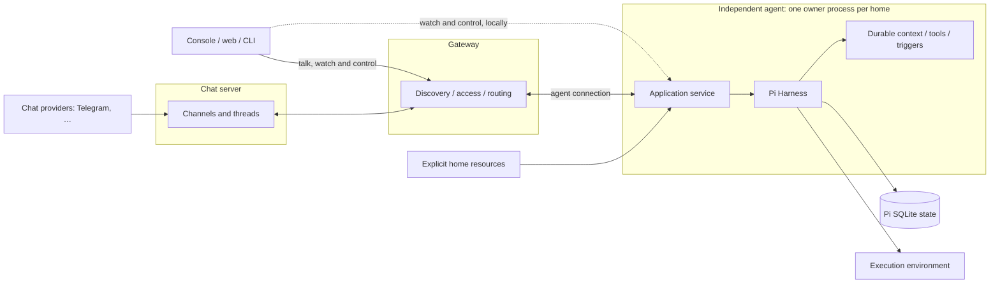

# 🦐 Pi Durable Replacement Plan

Updated: 2026-10-03
Status: experience decisions reviewed on 2026-10-03. Implementation has not started. A few interface and command details are left for the phases that build them.

Shrimpy's session machinery gets replaced with `pi-durable`. Each agent becomes an independent program: one resident process owns its home and its Pi storage. People talk to agents in threads kept by a chat server, from the console, the web app or chat providers such as Telegram, and clients can attach to an agent to watch and steer its work. Pi owns admission, queues, transcripts, task lifetimes, cancellation, compaction, recovery and committed observation. Shrimpy owns the home, the agent's context and tools, the clients, and the routes in.

The aim is fewer state machines, clearer ownership, and a smaller, better organized codebase. Switching engines doesn't license quiet changes to how people or agents use Shrimpy: every visible change is listed under [experience decisions](#experience-decisions).

This file owns the architecture, experience decisions, phases and progress for this change. The [Pi research note](../research/pi-agent.md#pi-durable-source-and-recovery-investigation) owns upstream findings and probes. [Reference docs](../reference/README.md) describe what ships today.

## Direction

Confirmed during review:

- **Agents run independently.** Each agent runs in its own process, outside any gateway, and keeps working when clients or the gateway go away.
- **Every conversation is a thread in a channel.** A channel is a place: a DM with an agent, or a room with people and agents. It has a main thread, and side threads hold parallel topics. The console, the web app, Telegram and a future desktop app are all clients of channels; there's no separate way of talking to an agent from the console.
- **Sessions sit behind threads.** Each agent taking part in a thread keeps one current session for it: its private work. Work with no thread, such as a helper's, has a session too. Opening the terminal or web app, picking an authorized agent and entering any of its sessions to watch, steer or stop it is core UX, locally or through a gateway.
- **A chat server keeps channels.** It's a service of its own that holds channels with their threads, messages and attachments, and bridges chat providers in: the shared record of what was said. Agents keep their sessions, their own private work. That's the split between channels and sessions Shrimpy has today.
- **The gateway only connects things.** It handles discovery, access and routing between clients, agents and the chat server, and keeps the workspace's configuration: registrations, tokens and workspace context. It never hosts agents or conversations. A gateway on Tailscale is the leading option for network identity and security.
- **Shrimpy leaves Pi's terminal app.** Shrimpy owns its session-client contract and presentation, reusing public `pi-tui` components where they fit.
- **Pi's durable runtime is the engine.** Shrimpy reshapes around it instead of wrapping it.
- **Chat providers are interchangeable.** Telegram is one chat provider among possible others, such as Discord or iMessage. Shrimpy's chat behavior lives in the chat server, and each provider only translates its own API. A desktop chat app, possibly a fork Shrimpy maintains someday, would plug in the same way; it isn't part of this plan.
- **Agents decide what wakes them.** The chat server offers each new channel message to member agents, and each agent's wake policy decides whether it starts a turn, as `channelPolicy` does today. By default an agent wakes only for DMs and mentions, and an included skill teaches agents to tune their own policy. Loop protection lives there too; nothing upstream filters conversation.
- **Sandboxing is a deployment choice.** An agent runs the same with or without a sandbox. When it is sandboxed, the sandbox wraps the whole agent process. Shrimpy doesn't sandbox individual tools, so agents keep a real shell.

This direction comes from the `REDESIGN` branch (2026-09-19): independent agent homes, a front door on Tailscale, one API for every client, and skills in place of subsystems. Its contracts built on Pi's `AgentSession` and its `shrimpy2/` scaffold are superseded here. It differs in one place: triggers, today's watches, stay in the agent's runtime instead of moving to OS schedulers ([see below](#delegation-and-recurring-work)).

## Words

| Word | Means here |
|---|---|
| Agent | An enduring identity with its own home. Pi uses "agent" for the configuration a conversation runs with. |
| Channel | A place where people and agents talk, such as a DM or a room, kept by the chat server. |
| Thread | One conversation inside a channel. Every channel has a main thread. |
| Session | An agent's private work behind a thread, or behind work with no thread. Pi calls this a conversation. |
| Helper | A child session an agent starts to split up its own work. Pi calls these subagents. |
| Trigger | Anything other than a message that wakes an agent: a time, an interval or a check whose output changed. Today's watches. |
| Chat provider | A bridge between a channel and an outside chat app, such as Telegram. |
| Chat server | Keeps channels, threads, messages and attachments, and bridges chat providers in. |
| Gateway | Connects clients, agents and the chat server, and keeps the workspace's configuration. It never hosts agents or conversations. |
| Workspace context | The shared `context/` files every agent reads, hosted by the gateway. |

## Plan at a glance

| Phase | Afterward you can… | Stop or decide if… | Deletes |
|---|---|---|---|
| [0. Spike](#0-spike) | Know whether durable, `pi-tui` and Pi's browser client fit, before building anything else | One of them needs a large compatibility layer: revisit durable | Nothing |
| [1. Standalone agent](#1-standalone-agent-and-attached-clients) | Run one agent as a service, natively or in a sandbox; talk to it in threads from the CLI, terminal and a basic web view; detach, kill it, reattach and see what happened | Terminal parity needs a large compatibility layer | Nothing; new tree only |
| [2. Context and tools](#2-context-tools-and-compaction) | See exactly what the model received and why; tools, skills and compaction run on durable | — | Old prompt, recording and compaction paths |
| [3. Daily driver](#3-daily-driver) | Do normal daily work in the new terminal and web clients | A changed affordance has no decision | Private TUI patches, old transcript readers |
| [4. Communication](#4-communication-and-the-gateway) | Chat through Telegram, the first chat provider, and between agents; attach to an agent through the gateway | — | Old channel loop, global turn and cursor state |
| [5. Triggers and delegation](#5-triggers-and-delegation) | Run triggered and delegated work that is honest about what a restart interrupted | A capability can't be kept: back to review | Old watch and worker stores |
| [6. Candidate release](#6-candidate-release) | Install, update, stop and uninstall a release with one engine | Client complexity outweighs runtime savings | The rest of the old tree |
| [7. Cutover](#7-cutover-and-rollback) | Run live homes on the new release, with a tested rollback | — | Nothing live |

## Experience decisions

Each row has a decision status:

- **Keep:** the outcome stays the same. Its phase still has to prove it.
- **Change:** a recommendation waiting for your call.
- **Confirmed:** decided in review.
- **Open:** not decided yet.

If implementation finds another visible difference, add a row before shipping it. That covers tool text and results, prompts, defaults, keys, command names, JSON, context, lifetime, retention, delivery, timing and cost. A prototype may skip features to answer a narrow question, but it must list what it skipped. Live cutover needs every affected capability kept or explicitly changed.

### Lifetime, launching and clients

| Topic | Today | Proposed | Decision |
|---|---|---|---|
| Closing a client | The interactive session disposes its runtime on exit | The client detaches and accepted work keeps running. Quitting while the agent is busy prints one line saying the work continues and how to stop it. Reopening shows committed state, and threads and sessions mark replies and work that arrived while you were away. | Confirmed |
| Stopping and cancelling | — | Service stop halts execution and keeps records; restart follows the [recovery](#input-cancellation-and-recovery) rules. Cancelling work is a separate action, scoped to one session or the whole home, and the three controls are labelled so they can't be confused. Shutdown stops taking new work, gives running turns a short timeout to finish, then pauses the rest; `--now` skips the wait. | Confirmed |
| Bare `shrimpy` | Most recent interactive agent and its main chat | Opens your most recent thread with the most recently used agent, and starts that agent's service on demand if installed. Startup failure is explicit and keeps the editor draft. Workspace-wide gateway controls become per-agent controls. | Confirmed |
| Several clients | A second terminal fails because the first owns the transcript | Clients share the agent's process and Pi orders the input. The UI shows the selected agent, thread and incoming messages. Switching views mid-turn is immediate; the previous thread's work keeps running and stays easy to find. Esc from any client stops the session for everyone. What you type in any client posts to the thread, so every client of the channel sees it. | Confirmed |
| Terminal and web clients | Terminal only; the web app is a read-only inspector | Both talk in threads and open the sessions behind them, locally or through the gateway. Opening a view never creates an execution owner. Offline agents, lost routes and rejected input show explicitly. Navigation, controls and permissions still need review. | Confirmed |

### Conversations and history

| Topic | Today | Proposed | Decision |
|---|---|---|---|
| Working contexts | One session per agent for each chat or binding | One session per agent for each thread it takes part in, with its own history and model settings and the home's shared resources. No master session and no shared transcripts. A new thread isn't a new agent or a filesystem boundary. | Confirmed |
| `shrimpy run` | Ephemeral; prints intermediate and final assistant text | Posts to a thread, a new one in your DM with the agent unless one is selected, and prints the final settled answer. Scripts that parse today's output or exit codes need updating. | Confirmed |
| New, reset, archive, resume | New and restore wait behind running work and swap JSONL files | A new topic is a new thread, and the old one stays to come back to. Reset clears the agent's context for a thread, while the thread's messages and the agent's earlier work stay browsable; a chat app without threads, like a Telegram private chat, uses reset for `/new` as today. Archive hides a thread without deleting it, and resume reopens one. A new thread starts at once, even while the agent is busy, because an agent runs its sessions side by side, and late replies in the earlier thread still arrive there. | Confirmed |
| Identifiers | Path-shaped session IDs | Channels, threads and sessions get short, stable IDs, and channels and threads have names you can change. A session is identified by its agent and thread. A new thread shows its first message until it's named. CLI JSON, search hits, anchors, URLs and copied links change. Choose a form that can gain a machine prefix later. | Confirmed |
| Old history | JSONL transcripts | Shrimpy converts nothing. Old transcripts stay in the old workspace, and each agent brings over whatever it wants from there itself. Channel logs aren't carried over, so new channels start empty. | Confirmed |

### Input, cancellation and recovery

| Topic | Today | Proposed | Decision |
|---|---|---|---|
| Busy external input | Queues as a follow-up; Telegram groups bursts | Same, with burst grouping shared by every chat provider. Steering stays an explicit action. | Keep |
| Stop | Stops the current run; queued turns stay | Pi's abort cancels the session's current work, withdraws messages still waiting for the agent and aborts foreground children. Those messages stay in the thread, marked as skipped, and the agent sees them as unread the next time it wakes. | Confirmed |
| Completion | Inferred from the first `agent_end` | Submission settlement. Accepted, queued, running, answered, unanswered and cancelled are distinct, and an interrupted tool inside an answered submission shows both facts. `shrimpy run` waits for settlement and exits 0 when answered, including an agent that stays silent with `END` and prints nothing; 1 when it failed or ended without an answer; and 130 when cancelled. `--no-wait` returns once the message is accepted, with an ID to wait on. | Confirmed |
| Recovery after a crash | — | Visible, not seamless. A partial model stream is kept as aborted and the request is sent again, which may cost again. An unsafe tool is reported as interrupted and isn't replayed. External processes may have kept running. Show a notice and keep diagnostics. Unfinished work resumes automatically, but a turn that has been resumed and crashed twice is stopped, marked failed and explained. | Confirmed |

### Terminal, models and settings

| Topic | Today | Proposed | Decision |
|---|---|---|---|
| Terminal affordances | Pi's `InteractiveMode` plus Shrimpy patches | Keep before any visual redesign: regular and fullscreen modes, editor history and multiline input, draft recovery, file completion, clipboard text and images, external editor, copy and suspend keys, `!` and `!!`, editing a message the agent hasn't picked up yet, tool-output expansion, hidden turn context, title, header and footer, and readable model, usage and errors. Ctrl+C doesn't exit immediately as Pi's demo does; Esc follows the stop decision. | Keep |
| `/agents` | Agent and chat navigation | Same, over agents, channels and threads. Helpers appear in a separate work view and never become agents. That view's labels, visibility and cancellation need review. | Keep |
| Model selection | Favorites, no accidental cycling, Enter applies, Ctrl+S saves a default, per-agent thinking | Same gestures. Fix Ctrl+S, which today reaches a workspace Pi setter that Shrimpy's config validation forbids: it sets the current session's model and saves a one-candidate home default. Other sessions and named policies are unchanged. Policies still pick the first available candidate at open; they don't fail over after errors. | Confirmed |
| Settings ownership | Credentials, model catalogs and policies, compaction and skill switches are workspace-wide | Home-owned defaults with session overrides. Provider login repeats per home unless a shared read-only config is referenced; mutable OAuth stores keep one owner. Appearance and favorite models are per-user client settings on each machine. Ambient Pi settings are ignored. | Confirmed |
| Setup and auth | — | Existing files survive; local endpoints, API keys and OAuth work; errors say what to do next; credentials belong to the home. No credential copying, cache warming or per-request model routing. Login works the same for [sandboxed and remote agents](#sandboxed-and-remote-agents). | Keep |
| `shrimpy update` | Opens the mechanic TUI with the update skill | A deterministic preview by default. `--guide` runs the update skill in an ordinary thread. Exact tag or SHA apply stays explicit, with approval before consequential changes. The hidden `update check-mechanic` becomes ordinary preflight. | Confirmed |

[Command coverage](#command-coverage) lists every CLI family and inherited slash command. A command missing upstream isn't removed implicitly.

### Instructions, memory and skills

| Topic | Today | Proposed | Decision |
|---|---|---|---|
| Instruction selection | Approved base context, `SOUL.md`, agent context, skill precedence and required-tool filtering; ambient `AGENTS.md` and global Pi skills and settings excluded | Same, with the workspace's shared `context/` files coming from the gateway. Facts are captured when queued input is consumed, and later edits don't rewrite committed context. | Keep |
| `/reload` | Refreshes skills and templates; base files load only at session open | Also rebuilds base instructions, for later inputs only. Code, tool or environment changes need a drain and restart. | Confirmed |
| Automatic awareness | Sender, destination, time and session facts; a channel unread count with a preview of the latest message; memory breadcrumbs; fleet and gateway status; other-session activity; worker and watch summaries | Keep sender, destination, time and session facts, the thread's unread messages, and memory breadcrumbs. Unread messages appear as written, the way a person scrolls a chat room: who said what, when, and whether it was addressed to this agent, newest last, within the turn-context budget. Nothing summarizes them. Drop the rest from every request, and give agents instructions for checking status, other threads and sessions, triggers and workers when they need to. Keep three breadcrumbs and the 6,000-character budget. | Confirmed |
| Workspace context | Shared `context/` files in the workspace that every agent reads | The gateway hosts the workspace's `context/` files, and agents receive them through the API. Each agent keeps a cached copy for when the gateway is unreachable and picks up changes on reload, at the cost of one prompt-cache miss. You or the mechanic edit them in one place. | Confirmed |
| Memory | Ordinary files; mechanic can search every agent | Same files. The mechanic reaches other agents' homes over SSH instead of a built-in all-agent search. | Confirmed |
| Context producers | Opt-in commands with channel matching, caching and bounds | Same features. Each preparation makes one attempt, checkpointed by Pi; a crash after it starts reports interruption instead of rerunning. A failure leaves a breadcrumb and the request continues. Previews never run producers. | Confirmed |
| Compaction | A copied runner with Shrimpy's guidance | Pi's native compaction with Shrimpy's summary guidance for dates, voice, paths and work state; same thresholds and model at first. Qualify summary quality before deleting the copy. Compaction only shrinks the session, so agents are told they can re-read the thread when a detail went missing. | Confirmed |
| Skills | Trails, `/skill:name` and templates | Same, rewritten against the new CLI and tools. | Keep |

### Tools and publication

| Topic | Today | Proposed | Decision |
|---|---|---|---|
| Publication rule | Assistant text in channel conversations is private; only tools publish | A turn's final assistant text goes to the thread its message came from, unless it is exactly `END`, it is empty, or the turn already posted to that thread through a tool. Text earlier in the turn stays private, and so does the final text of work with no thread, such as a helper's. Many models forget to call a reply tool, so replying becomes the default, and `END` lets an agent stay silent, which also stops polite goodbye loops. Messages sent mid-turn or elsewhere use the [message tools](#tools-and-publication). | Confirmed |
| Message tools | `reply`, `ask`, `notify`, `report`, `send_message({channel, text})` and `read_channel({channel, limit?})`. The first four only differ in a label nothing acts on, except that `quiet` or low-urgency `notify` delivers silently on Telegram; `batchable` is stored but unused. | Two tools. `send_message({text, to?, quiet?})` posts to this thread when `to` is omitted, or to `@agent` or `@person` for a DM, `#channel` for its main thread, or `#channel/thread`. A person is reached where they were last active, as `user:<id>` does today. `read_messages({from?, limit?, before?})` reads with the same addresses, defaulting to this thread. The final-text default covers what `reply`, `ask` and `report` did, and `quiet` covers `notify`. For example, `notify(text, urgency="low")` becomes `send_message(text, quiet: true)`, `send_message(channel="dm~mechanic~shrimpy", text)` becomes `send_message(text, to: "@mechanic")`, and `read_channel(channel)` becomes `read_messages(from: "#channel")`. | Confirmed |
| Publication results | — | Success means the delivery owner accepted it. Pending, delivered, failed and uncertain are a separate status. A person's last-active destination is fixed when the message is accepted. A message that was accepted but later fails or becomes uncertain is noted in the agent's next turn, so it can fix and resend. | Confirmed |
| Publishing while chat is unreachable | Replies append to the channel log on disk, and the gateway's outbox delivers them when it runs | The agent tracks whether it's connected. Publication tools fail with an explanation the model can act on: not sent because chat is unreachable, so try again later. A send that went out without confirmation reports itself as uncertain. Each publication carries its tool call's ID, so a retry never posts twice. A final message that can't be sent when a turn ends is recorded, and the agent's next turn includes a note so it can decide whether to resend. | Confirmed |
| No-reply watchdog | An extra model call after silent human turns, which may inject a prompt | Removed. Sending the final message by default covers what it was for. | Confirmed |
| Codemode | Not enabled | A later experiment, once the core tools work: a durable tool wrapping the standalone `pi-codemode` package. The model writes a short script that calls the agent's other tools in parallel, and only the script's output enters context. Nested calls get the same validation and tool policy as direct calls and show up in clients. Its small store lives in a session document. A crash mid-script reports the whole script as interrupted. MCP through the standalone `pi-mcp` package would build on it later. | Confirmed |
| File tools | `read` (with images), `write`, `edit`, `bash`, `grep`, `find`, `ls` | Same surface. Durable's stock four tools lack image reading and search, so add focused durable tools. Side-effect tools stay unsafe. | Keep |
| Pi extensions and themes | Discovered trusted extensions add tools, commands and renderers | Shrimpy's four bundled extensions become console features, and its theme carries over if the console reuses `pi-tui` theming. Pi's extension and package discovery is dropped, since durable can't run those extensions. | Confirmed |

### Delegation and recurring work

| Topic | Today | Proposed | Decision |
|---|---|---|---|
| Helpers | — | An agent can start helpers: child sessions in its own process, with its home and authority. Foreground helpers join and stop with their parent. Background helpers outlive it and wake the parent with their result when they finish. Helpers appear in a work view and never become agents. Pi calls them subagents. | Confirmed |
| Workers | Detach and outlive the caller | Same default. Codex keeps its real continue, send, wait and cancel protocol; after the owner dies it isn't a restored Pi child. Renaming or removing worker commands or backends needs review. | Keep |
| Triggers | Watches, run by a global gateway clock | Renamed, because not everything that wakes an agent is a time. A trigger fires into a target thread, where it shows as a small trigger line with its prompt or output folded before the agent's reply, or into no thread for private background work. A small durable extension in each agent with cron and intervals, prompt and command actions, one coalesced overdue run, skip-on-overlap by default, timeouts, output filters, history and reload ([contract](#triggers)). An invalid reload keeps the last valid definitions. Upkeep triggers stay disabled when installed. A stopped agent runs no triggers, and restart doesn't backfill. | Confirmed |
| Triggers in the agent or the OS | — | In the agent's runtime, where durable tracks every run and you inspect them in one place. The `REDESIGN` branch had moved them to skills over launchd and systemd so they'd fire while the agent is down; a stopped agent now runs none. | Confirmed |
| Cancel, disable and stop | — | Three separate controls. Cancelling work stops running occurrences and helpers but not the triggers themselves. Disabling a trigger stops future firings without killing a running one. Service stop interrupts everything and keeps state. | Confirmed |

### Channels, chat providers and the web app

| Topic | Today | Proposed | Decision |
|---|---|---|---|
| Where channels live | JSONL logs in the shared workspace | On the chat server, which keeps their threads, logs and membership. Losing the chat server or the gateway pauses chat; agents keep working and catch up on missed messages when they reconnect. | Confirmed |
| Threads | A Telegram chat maps to one channel, with one session per agent | Every channel has a main thread, and side threads hold parallel topics. Chat apps without threads use only the main thread; Telegram topics and Discord or Slack threads map to threads. | Confirmed |
| Bridged chats | A Telegram-bound channel carries only Telegram's messages and the agent's replies | Messages typed in another client are mirrored into the bridged chat, posted by the bot and labelled with who wrote them, so everyone there sees the whole thread. | Confirmed |
| Wake policy | Each agent's `channelPolicy` decides which visible messages start a turn: `all`, `mentions`, `addressed` or `none`, plus sender filters. An omitted policy means `all`, and setup gives the primary agent `all` | Owned by the agent. The default is `mentions`, so an agent wakes for DMs and messages that mention it, and setup gives no agent `all`. An included skill explains wake policies so agents can tune their own. Loop protection stays on the agent side: wake policies, instructions against banter, and `END` to stay silent. Neither the chat server nor the gateway has loop rules. | Confirmed |
| Chat behavior | Built into the Telegram surface: chat and sender restrictions, per-thread agent selection, `/new /clear /stop /thinking /status /help`, permission-filtered help, notices, typing, formatted and chunked output, quiet notices, sender labels, 500 ms burst grouping | Same behavior, moved into the chat server so every provider gets it. Telegram keeps only what is Telegram's: its API, bot suffixes, message limits and formatting, and album order and captions. Received messages and batch membership are recorded before processing is acknowledged. | Keep |
| Media | Telegram photos become local paths the read tool loads; other media is only noted as unsupported | Every attachment from any provider, including images, documents, voice notes and video, arrives as a file in the agent's home up to a size limit, delivered through the API ([attachments](#sandboxed-and-remote-agents)). The read tool loads images, and other tools in the agent's environment can use the rest. Inline vision bytes or transcription would be separate decisions. | Confirmed |
| Delivery | Bounded retries, history skipped on first start, no sends to unbound destinations | Same for every provider, with recipients and batches fixed across retries. A lost send acknowledgment shows as uncertain. | Keep |
| Web app | Read-only inspector | A client for talking and watching: browse channels, threads and agents, talk in threads, and open the work behind them. Keeps the inspector views: files, tree, context, channels, triggers, runtime, bounded transcripts, folded output, images, thinking, usage and follow-latest. Pi-backed queries replace JSONL reading. URLs, anchors, pagination and write permissions need review, including loopback, same-origin and CSRF rules once the web app can send input. | Confirmed |

### Sandboxed and remote agents

| Topic | Today | Proposed | Decision |
|---|---|---|---|
| Sandbox boundary | Agents aren't sandboxed | The whole agent process runs inside whatever sandbox or VM you pick, or none ([how](#sandboxing)). No per-tool sandboxing; `bash` stays available. | Confirmed |
| Attachments | Telegram photos and clipboard images are paths on the same machine | Attachments travel with their message. The chat server keeps them with the thread, and each is copied into an agent's home, up to a size limit, when the message is offered; the agent's tools use them from there. | Confirmed |
| Home edits | The CLI edits workspace files directly | Homes live where their agent runs, and edits happen there: by the agent itself, by `shrimpy` run in that environment, or by the mechanic over SSH to the machine hosting it. Remote clients get session operations and reload, not file editing. | Confirmed |
| Provider login | A browser callback on the same machine | Pi's login flows already handle a browser on another machine: they show a URL or device code and accept a pasted code or redirect URL. Shrimpy relays those prompts between the agent and the person's client. Sandboxes allow provider traffic, including login endpoints. | Confirmed |
| Agent identity at the gateway | — | People's devices are identified by Tailscale, so clients need no Shrimpy login. Each agent gets a token from the gateway when it's registered and presents it when it connects, and the gateway checks that the connection comes from the expected machine. An agent on the gateway's own machine connects locally, where socket permissions make that check. Giving an agent its own tailnet node, with Tailscale running inside its sandbox, stays optional. | Confirmed |

## Not built

This plan deliberately leaves these out, so they don't creep back in:

- Sandboxing for individual tools. Agents keep a real shell.
- A second run queue, transcript, task manager, outcome journal or activity cache beside Pi's.
- A compatibility layer for Pi's ordinary `ExtensionAPI`, or a generic service framework.
- A controller lease between clients, unless a real need appears.
- Heartbeat-based lock takeover or a PID ledger.
- A global scheduler, universal worker registry or network-wide job ledger.
- Automatic migration of old transcripts, tasks, manifests or clocks.
- Model calls to route ordinary input.
- Loop or flood control in the chat server or gateway. Agents' wake policies, instructions and `END` handle it.
- Native MCP, per-request model routing, cache warming, vector memory, journaling daemons and transcription. Each is a separate future decision; codemode is a [later experiment](#tools-and-publication).
- A mesh protocol, ACP product, visual redesign or mandatory hosting platform.

## Later

Work this plan defers on purpose, to pick up after cutover:

- Notifications wherever you want them (desktop, chat or phone) when work finishes while you're away.
- Codemode, as a [later experiment](#tools-and-publication).
- A plain HTTP entry point, once a program that can't speak Pi's protocol needs in.
- A desktop chat app as the native client for channels.

## Architecture



### Agent home

An agent home works on its own, with no workspace pointer, gateway, mechanic or other agent; it keeps a cached copy of the workspace context. It holds identity and instructions, selected resources and skills, retained knowledge, provider credentials and defaults, and Pi storage. Local registration only maps a name to a home and endpoint.

Proposed layout; final paths settle with setup and the CLI:

```text
agent.json
SOUL.md
context/
vault/
skills/
triggers.json         optional
state/pi/auth.json
state/pi/models.json
state/agent.sqlite
runtime/              disposable endpoint and log files
```

Shared resources are explicit references, never ancestor or global discovery. Development uses fresh fixture homes, and no existing user data is transformed for a proof.

Homes under one OS user share that user's authority. Different permissions need a real OS environment boundary; a session, a home directory or a tool selection isn't one. Remote access distinguishes permission to message, observe, control and administer.

### Host and Pi

The host builds the model and credential runtime, the trusted durable registry, the environment resolver, SQLite storage and the service, then supervises them. Opening a home's storage changes it, because durable resets unfinished work on every open. The phase 0 spike saw a second process that only opened a live home flip the owner's running turn back to pending, and a second owner send a model request twice and corrupt the first owner's session. So only the owner ever opens a home's storage, and commands such as `log` and `inspect` go through the owner's API. The owner takes an exclusive lock on the home before anything else, including opening storage, starting servers or binding sockets, and holds it for its lifetime. The spike's 21-line lock on `node:sqlite` works on macOS; phase 1 qualifies it on Linux.

Pi owns submissions, `InboxDoc`, `LiveDoc`, `UsageDoc`, conversation entries and configuration, generation, tool and compaction tasks, checkpoints, child ownership and structural watches. Shrimpy reads them directly. Query indexes and UI caches are disposable and name their source.

Shrimpy's own documents hold only what Pi lacks: the thread each session belongs to; immutable source and target provenance; context-source evidence; and chat and trigger receipts and policy. Thread names and archive state live with the threads on the chat server. They are written through Harness commits. Pi's statuses are never copied into them.

The host gives each session an `ExecutionEnv`. Replayable operations need a stable resource and cwd identity. Extension code is trusted host code and can bypass the environment, and process cleanup is a separate guarantee from containment.

### APIs, clients and the gateway

Clients use two APIs, each the same for local and gateway-routed use. The chat server's API covers channels, threads, members, posting and reading messages with their attachments, and subscriptions. Each agent's API is a set of concrete operations:

- session inspection and selection
- reset, fork, steer, status, wait, withdraw and abort
- admitting the messages the chat server offers
- model, thinking, defaults and reload
- provider login, relaying Pi's login prompts to the person's client
- raw and effective context, entry queries and committed subscriptions
- completion against the agent's filesystem
- publication and chat-provider status, trigger and delegation controls
- receiving the attachments of offered messages into the agent's home

Every operation is reachable as `shrimpy <command>` before any UI uses it, and CLI handlers and tools call the same operations. For transport, use `pi-server`, `pi-client` and `pi-protocol` over a restricted local Unix socket first, where their public APIs fit. Coding-agent's experimental controller isn't reused wholesale because it drops durable request IDs. Pi's protocol carries everything Shrimpy ships: the console, the web client, the CLI, the chat server, and each agent's link to the gateway. Plain HTTP is added only when a program that can't speak Pi's protocol needs in, and not in phase 1. Only a Unix socket transport ships, so the web client needs a small WebSocket bridge; the spike's was 69 lines. Sockets live in a short runtime directory, because macOS caps Unix socket paths at 104 bytes. `pi-client` never reconnects on its own, so clients reconnect with backoff and mark a disconnected view as stale. The browser bundle is about 200 KB minified and 53 KB gzipped, mostly TypeBox. The protocol makes no compatibility promises, so Shrimpy pins Pi exactly, agents and clients upgrade together, and a version mismatch between peers is reported clearly.

Clients talk through threads and watch through sessions. Attaching straight to an agent covers watching, steering and stopping, including while the gateway is down. Clients render committed views. Help, status and editor state stay local and never enter the transcript. Completion and shell input run against the agent's paths, never the client's cwd, so an attached console asks the agent for completions instead of reading a local directory. Clipboard files and images attach to the message you send, like any other attachment, with provenance and size limits.

The gateway handles discovery, access and routing between clients, agents and the chat server. It keeps the workspace's configuration: agent registrations, tokens and workspace context. It never holds agent homes, Pi storage, execution or conversations, and it reaches agents' sessions only through their API. Agents connect out to it and reconnect on their own, so they need no inbound listener. Losing the gateway pauses chat and remote access but never stops an agent. Watching and controlling an agent on its own machine works without a gateway; talking needs the gateway and the chat server, and on a single machine both run locally.

### Chat server

The chat server is a service of its own, with its own store, so the gateway doesn't grow into one big service. It owns what channels share: threads, message logs, membership, attachments, burst batching, chat commands, sender access, addressing and mentions, formatting and chunking rules, mirroring into bridged chats, and delivery receipts. Each chat provider runs inside it and only translates its own API: authentication, polling or webhooks, message and media formats, and sending. Code outside a provider's own directory doesn't depend on which provider it is.

- **Storage.** SQLite through Node's built-in `node:sqlite`, like the agents, with the chat server as its only writer. A message, its batch membership, its attachment references and the provider cursor that delivered it commit together. Attachments are files next to the database. The store is user data, so back it up like a home, from a stopped snapshot or with SQLite's backup.
- **Offers.** After a message commits, the chat server offers it to each member agent through the gateway. Each agent's wake policy decides whether it starts a turn, and the agent keeps one session for each thread it takes part in.
- **Unread messages.** Each agent keeps a bounded copy of the messages it was offered, including ones that didn't wake it. It's a disposable cache whose source is the chat server. A turn's unread messages come from that copy, so they're captured when the message is consumed and still available while chat is unreachable. `read_messages` asks the chat server for anything older.

### Sandboxing

The agent process shares nothing with the outside except the network: no files, processes or `localhost`. Everything crosses the API. That keeps sandboxing a deployment choice, so the same agent runs natively, in a container, in a microVM or on another machine.

- **Entrypoint.** Shrimpy ships a foreground command that runs one agent until told to stop. A container, a VM's init, launchd or systemd can supervise it. The service installers are conveniences for running without a sandbox.
- **Network.** A sandboxed agent needs outbound access to the gateway and its model providers, including their login endpoints; Shrimpy assumes the sandbox allows provider traffic. It also needs whatever its work needs, such as git hosts or package registries. It needs nothing inbound. Egress beyond Shrimpy's own is each agent's policy. The gateway's authorization, not the firewall, limits who an agent can message.
- **Credentials.** Keys live in the home, which puts them inside the sandbox. Sandboxes that inject keys through a proxy also work, because provider endpoints and keys stay plain configuration and placeholder keys are accepted.
- **Easy-to-miss grants.** A model server on the host needs one, because `localhost` inside a sandbox is the sandbox. So does Tailscale's `100.64.0.0/10` range, which Microsandbox blocks by default.
- **Cleanup.** Stopping a VM or container stops every process the agent started, which native mode can't promise.
- **Local attachment.** A Unix socket works when the client shares the machine. A sandboxed agent is reached through the gateway or a socket the sandbox forwards.
- **Administration.** The mechanic reaches its neighbors over SSH to the machine that hosts them, then edits their homes directly or through the sandbox's own exec or mount. The sandbox itself still accepts nothing inbound.
- **Shared configuration.** A shared read-only config referenced by path needs a mount or a copy inside the sandbox.

The [sandbox runtime scout](../research/sandbox-runtime-scout-2026-08-26.md) compares candidate sandboxes.

## Runtime contracts

### Admission and retries

Every incoming operation carries an authenticated source, a stable event or request ID, immutable payload and attachment references, and a target home. Its session comes from the thread it belongs to, or an explicit session ID for steering and control, never from a model call.

Pi deduplicates request IDs per conversation, but accepts a reused ID even when the content differs. So Shrimpy keeps a narrow receipt (source key, payload fingerprint and chosen conversation) that rejects conflicting reuse and pins the target. Pi's submission stays the only execution and settlement record.

Admission happens in order:

1. Commit the target and binding idempotently.
2. Call public `Conversation.submit()` with the stable request ID.
3. Report acceptance only after admission succeeds.

A crash between steps 1 and 2 leaves an empty target that a retry completes. A crash after step 2 returns the original submission on retry. A later reset doesn't redirect old retries. Use only public APIs: no `submit()` inside a Harness commit, no private admission helpers and no raw `Tx.createSubmission()`.

- **Channel messages:** the chat server stores each message, or burst batch, before advancing a provider's cursor, then offers it to member agents. An agent admits it using the channel, thread and message IDs as the request ID, so a retry can't duplicate it or regroup a batch.
- **Other sources:** trigger occurrences and steering input use their own source namespaces. Transport and status correlation numbers aren't deduplication IDs.
- **Control changes:** creating or forking a session commits it together with its thread binding. Reset is a `write` submission containing a `ResetEntry` and a request ID. Thread names and archive state are versioned set-to-value updates, so an old retry can't overwrite a later decision. Default and resource saves return a version or require a re-read after a lost acknowledgment. Clients never retry a change automatically without such a rule.

### Prompt capture

A durable extension supplies base instructions, skill trails, input facts, memory breadcrumbs and compaction guidance. Dynamic facts are captured when input is consumed, with provenance and budgets, and committed before the request. Queued input sees the facts from when it was consumed, not when it was queued.

**Caching.** Stable text lives in prompt sections that don't change between turns: base instructions, workspace context, `SOUL.md` and skill trails. Durable appends a system delta whenever a section's rendered text changes, which invalidates provider prompt caches, so sections never embed timestamps, counters or other per-turn values. Per-turn facts such as time, sender, the thread's unread messages and memory breadcrumbs travel with the input entry instead. Each turn then only adds to the end of a cached prefix, and a reload costs one cache miss.

How Pi recovers shapes these rules:

- `beforeRequest` transforms stay pure. They run again after recovery, so reading files or the clock there would change a resent request.
- Prompt sections render again too, including after blocking compaction, so they can't run external commands. Producers run as public custom tasks. Their captures are keyed by the consumed submission ID and record the source and producer revision, and re-renders, compaction and recovery reuse that capture. Join tasks outside a commit.
- Throwing from a section doesn't signal failure; Pi can keep the old text and proceed. Show failed or interrupted producers as explicit diagnostics.
- Reload affects later inputs only. The registry, tool implementations and environment stay fixed for accepted work; replacing them needs admission to stop and a drain and restart.

Inspection shows raw entries, effective model messages, selected tools, source revisions, omissions and budgets, and the effective model and settings. Previews are labelled as previews; a captured request is the real evidence. Hidden context in the human transcript expands without blank rows.

### Triggers

- A trigger and each of its occurrences are separate durable tasks owned by a session. Occurrences are marked `background: true`, so changing or cancelling a trigger doesn't cancel a running occurrence.
- Persist the trigger revision, next occurrence and target thread, if any. Admit prompt work with a stable trigger and occurrence ID.
- Command occurrences record intent before running. If an unsafe command had started when the owner died, the occurrence reports interrupted and isn't rerun. A finished result and emission decision are kept, so an admission retry doesn't repeat the check.
- The extension owns coalescing, overlap, timeouts, emission, reload and cancellation policy. Pi owns checkpoints, outcomes and observation. The host only installs code and seeds selected definitions.
- Cancelling all work in a home includes running occurrences and helpers, not enabled triggers.
- Reuse the existing calendar and output-filter helpers.

### Effects, cancellation and storage

- **Unsafe by default.** Every built-in durable tool is unsafe; writes, edits, shell commands and unqualified sends stay that way. A custom `safe` declaration needs a stable target and proven deduplication by task or call ID. Deduplicating accepted sends still isn't exactly-once delivery, so uncertain results stay visible.
- **Ownership.** Foreground ownership controls joins and abort; background ownership is explicit. A client disconnect, navigation or cancelled wait never aborts accepted work. Abort reports done only after cancellation settles. Controls never hold a transaction while waiting on their own running turn.
- **Supervision.** Shutdown is bounded and accounts for tool descendants. Cooperative abort kills owned process groups, but killing the owner can leave detached processes running. Prove cleanup with a delayed-write child under the chosen supervisor before advertising it. If that can't be guaranteed, show possible continuing effects and flag the limit for review.
- **Storage.** SQLite in WAL/NORMAL mode survives process crashes, not power loss. Back up from stopped snapshots that include the WAL. Pin Pi's package and task contracts. Before opening admission, the host checks extensions and pending task definitions and names affected sessions on failure, because Pi alone may drop a missing extension or block single tasks. Upgrading pending work needs compatible definitions or a reviewed disposition.

## Replacement map

Reuse small filesystem, search, formatting, calendar, model-policy, transport and installation helpers where they still serve the new owner. This maps responsibilities, not folders to move.

| Current responsibility and source | New owner, and what gets deleted |
|---|---|
| `src/app/runtime.ts`; `src/sessions/open.ts`, `bootstrap.ts`, `resolver.ts`, `spec.ts`, `foreground.ts` | Explicit home and host construction. Delete the global workspace composition and foreground session owner. |
| `src/sessions/pool.ts`, `turn-output.ts`; gateway turn and runtime state | Pi admission, inbox, submission settlement and committed views. Delete lane promise chains, completion inference and parallel activity and outcome records. |
| `src/sessions/ownership.ts`, `control.ts`; gateway control messages | One home lock and service operations. Delete competition for transcripts between foreground, gateway and maintenance, and channels used as control transport. |
| Session recording, manifest, transcript store, inventory and search; the copied compaction runner | Pi entries and projection, minimal session metadata and derived queries. Delete the second transcript lifecycle and compaction paths. |
| `src/context/*`, resource loading, included instructions and skills | The durable home-context extension, producer helpers and committed provenance. Delete global-runtime dependencies and `ExtensionAPI` bindings. |
| `src/tools/daemon.ts`; channel routing, bus, activity and outbox; `src/agents/channel-policy.ts` | The two message tools, the chat server, which owns routing and delivery, and wake policy in each agent's service. Delete the shared bus and duplicate turn state; keep needed delivery receipts. |
| `src/workers/*` | Helpers on durable's child and background ownership; a focused adapter or skill for Codex. Delete the universal worker supervisor and backend state. |
| `src/watches/*`; gateway watch service and clock | The durable trigger extension. Delete the global clock, execution history and orchestration state. |
| `src/tui/*`, root UI extensions, `src/app/pi-internals.ts` | The attached console client on public components. Delete private `InteractiveMode` patches and runtime lifetime coupling. |
| Telegram and shared surface code; `gateway/web-sidecar.ts`; web JSONL readers | The chat server with Telegram as its first provider, and the API-backed web client. Delete sidecar lifetime coupling and byte-cursor reading. |
| `src/cli.ts`, commands, setup, update, service installers, help and completion | Commands over the new owners, per-home service installation, deterministic setup and update helpers. Delete obsolete registrations and aliases once coverage is reviewed. |

A replaced slice removes its old imports, registrations, unused dependencies, fixtures and instructions. The shipped result has no `legacy` path, dual-engine mode, error-only shim, renamed task manager or second application tree.

## Target source layout

This is the layout after phase 6. Until then the new tree lives under `next/`, with its own build and tests, so it never collides with today's `src/` (both have a `gateway/`, a `util/` and a `cli.ts`) and never rewrites the live `dist/`. Phase 6 moves `next/` into `src/` and deletes the old tree, along with the old tests, which test old internals. The new `gateway/` and `extensions/` replace today's; they don't extend them.

```text
src/
  cli.ts          argv entry; dispatches to cli/
  home/           home layout, agent.json, resource and skill selection, model policy, credential paths
  api/            channel and agent API contracts: operations, errors, and the callers used by clients and tools
  host/           owner process: lock, model runtime, registry, environment, Harness/SQLite, supervision, service install
  service/        API operations over the Harness: admission receipts, thread bindings and wake policy, session metadata, control, queries, subscriptions
  extensions/     durable extensions installed in the registry
    context/      prompt sections, turn facts, producers, memory breadcrumbs, compaction guidance
    tools/        message tools, search, image reading, helpers
    triggers/     trigger and occurrence tasks
  gateway/        discovery, access control, routing, registrations, tokens, workspace context
  chat/           chat server: channels, threads, messages, attachments, batching, commands, sender access, mirroring, delivery receipts
    telegram/     Telegram's API: polling, message and media formats, sending
  client/
    console/      terminal client for threads and sessions
  cli/            commands over api/, or home/ for offline home files
  util/
web/              web client for threads and sessions, over api/
```

| Module | May import |
|---|---|
| `util/` | nothing else in `src/` |
| `api/`, `home/` | `util/` |
| `extensions/*` | Pi durable extension API, `api/`, `home/`, `util/` |
| `service/` | Pi durable, `api/`, `home/`, `util/` |
| `host/` | Pi durable and server, `service/`, `extensions/`, `home/`, `util/` |
| `gateway/`, `chat/`, `client/*`, `web/` | `api/`, `util/`, and their own configuration |
| `chat/<provider>/` | `chat/`, `util/`, and its own configuration |
| `cli/` | `api/`, `home/`, `util/`, `client/` to launch it, and `host/` only for commands that start or install the owner |

Only `host/`, `service/` and `extensions/` import Pi's durable runtime. Clients, chat providers and the gateway reach an agent only through `api/`. Enforce these rules with ESLint `no-restricted-imports` once the directories exist, including a ban on deep imports into Pi packages: `pi-tui` has no exports map to stop them.

### Size baseline

Measured at `574bb2c` from tracked files. Counts are raw lines, including blanks and comments.

```bash
for d in src/*/ extensions web test; do printf '%-18s %6s\n' "$d" "$(git ls-files "$d" | grep -E '\.(ts|tsx|js|mjs|css|html)$' | xargs cat | wc -l)"; done
```

| Area | Lines |
|---|---|
| `src/commands/` | 7,436 |
| `src/sessions/` | 6,108 |
| `src/surfaces/` | 4,426 |
| `src/context/` | 3,964 |
| `src/skills/` | 3,824 |
| `src/channels/` | 3,211 |
| `src/tui/` | 2,498 |
| `src/gateway/` | 2,282 |
| `src/watches/` | 2,238 |
| `src/setup/` | 1,908 |
| `src/workers/` | 1,424 |
| `src/workspace/` | 1,301 |
| `src/agents/` | 1,200 |
| `src/config/` | 811 |
| `src/tools/` | 605 |
| `src/app/` | 599 |
| `src/instructions/` | 438 |
| `src/util/` | 378 |
| `src/update/` | 356 |
| `src/cli.ts`, `src/gateway.ts` | 235 |
| root `extensions/` | 192 |
| `src/inference/` | 102 |
| **`src/` and `extensions/`** | **45,536** |
| `web/` | 3,099 |
| `test/` | 27,026 |

Each completed phase adds a row to the size log. Note any directory that grew or shrank unexpectedly beside it.

| Phase | `src/` + `extensions/` | `web/` | `test/` | Net vs baseline |
|---|---|---|---|---|
| Baseline `574bb2c` | 45,536 | 3,099 | 27,026 | — |
| 0. Spike `5c6184b` | 45,536 | 3,099 | 27,026 | 0 in the old tree; `next/spike/` adds 1,964 lines of probe code |

## Phases

Work in an isolated feature branch and checkout with fixture homes and separate build output. Never run the root build or tests in the live checkout: they rewrite the `dist/` that the installed CLI uses. Candidate services, sockets, binaries and home paths stay separate from the installed application. Each phase ends by adding its row to the [size log](#size-baseline). `main` stays on Pi `0.84.4` until the candidate replaces it; there's no interim upgrade.

### 0. Spike

**Outcome:** answers to the three questions that decide whether durable fits, with as little code as possible and before anything else is built.

**Build**

- A durable host with one agent, one thread and a real provider, driven from a small CLI.
- A terminal view of that thread built from public `pi-tui` components.
- A browser page attached through `pi-client` over a WebSocket bridge to `pi-server`.

**Prove**

- Killing the host mid-turn and mid-tool, then restarting: the model request is sent again and the tool is reported as interrupted.
- The terminal view shows streaming text, tool calls and an editor without patching `pi-tui` internals.
- The browser page bundles `pi-client` and Chord without Node-only dependencies such as `esbuild`, gets a snapshot and live updates, and sends a message.

**Gate:** if any of these needs a large compatibility layer, revisit durable before phase 1. The spike is a probe: phase 1 keeps what fits and deletes the rest.

**Result:** done on 2026-10-03. All three questions fit; see the [spike report](../../next/spike/REPORT.md).

### 1. Standalone agent and attached clients

**Outcome:** one agent runs as its own service, with a minimal local gateway and chat server. You talk to it in threads from the CLI, the terminal and a basic web view, close them, kill the service, reopen, and get an honest account of what happened.

**Build**

- Pin the durable, AI, Chord, server, client, protocol and TUI packages at `1.0.0`, align Pi-facing schemas, and record the installed versions. Use public exports only.
- Home → model runtime, registry and environment → Harness on SQLite → service → CLI → terminal and basic web view, with no old session runtime.
- A minimal local gateway and chat server, so talking goes through threads from the start. No chat providers, rooms, remote routing or tokens yet.
- The OS lock that makes one process the owner of a home.
- The foreground entrypoint that any supervisor or sandbox can run.

**Prove**

- A real provider turn using file and shell tools.
- Two threads in your DM with the agent, reset versus a new thread, streaming and tool progress, a draft kept on failure, and model selection.
- Stopping with a message waiting: it stays in the thread as skipped, and the agent reads it next time.
- Detach and reattach, and two clients at once. The web view uses the same operations as the terminal.
- Killing the owner mid-turn, a lost admission reply, a reused request ID with the same and with different content, and close versus abort.
- A second owner is refused, and a second home shares no defaults, credentials or history by accident.
- What the supervisor does with a shell child that was started before the kill and writes a file later.
- The same agent inside one real sandbox or VM, with the client outside and no shared files.
- Early cost checks: image reading and context capture.

**Gate:** if terminal parity needs a large compatibility layer, stop and revisit with that evidence. Record the prototype's experience differences and its real code and dependency cost.

### 2. Context, tools and compaction

**Outcome:** for any request you can see exactly what the model received and why, and it matches what ran. Tools, skills and compaction run on durable.

**Build**

- The home-context extension: base instructions, skill trails, input facts, memory breadcrumbs and compaction guidance.
- The two message tools, search and image reading.
- Request and context inspection, and explicit reload.
- Ported skills and helper commands, with their tool requirements and precedence.
- Native compaction with Shrimpy's guidance in place of the copied runner.

**Prove**

- Context is captured at consumption for queued input, steering, tool rounds, reload, compaction and restart.
- Real provider input matches live and reopened raw and effective history.
- Editing a context file while work is queued: in-flight input, newly consumed input and a resent request each use the right version.
- Killing the owner around a producer's effect and result commit, and during blocking compaction. Failures and caching behave as specified.
- Previews run no producers.
- A model tool call spanning a resource reload and an attempted code or environment swap.

**Deletes:** the old prompt, resource, recording and compaction execution paths.

### 3. Daily driver

**Outcome:** you do normal daily work in the new terminal and web clients, without the old `InteractiveMode` host.

**Build**

- Thread and session operations: new thread, reset, archive, resume, fork, names, search, read and export.
- Model, defaults, settings, setup and auth as decided above; status and help come from the service.
- Web navigation of channels, threads, agents and sessions, with history, live view and input, alongside the inspector views.
- Attachments on messages, including clipboard files and images.

**Prove**

- Every inherited command's disposition in [command coverage](#command-coverage).
- Keyboard, editor, file, image and shell interactions.
- Agent navigation, preflight failure and several clients. A failed switch restores the previous view and draft.
- Web queries and subscriptions, new IDs and anchors, and large transcripts.
- Presentation content never reaches provider input.
- A side-by-side comparison with today's workflows in isolated homes; fixture tests don't prove usability.

**Deletes:** private TUI patches, the old transcript readers and duplicated settings and lifecycle bindings.

**Gate:** every changed or missing affordance has a decision.

### 4. Communication and the gateway

**Outcome:** chat through any provider, starting with Telegram, and agent-to-agent messages go through the same admission, and you can attach to an agent in another process through the gateway.

**Build**

- Source bindings and publication and delivery operations.
- The rest of the chat server: rooms with several members, the shared chat behavior, mirroring into bridged chats and wake policies in each agent, then Telegram as the first provider, reusing the existing sender, formatting and media helpers, without `AppRuntime`, `SessionPool` or the control bus. One poller per shared bot, and an explicit owner for cursors, batches and receipts.
- Gateway registration and routing, with agents connecting out to it.
- An included skill that teaches agents to set their own wake policy.

**Prove**

- An agent in a separate process from the gateway, with terminal and web attaching through it using the same contract as local use.
- Switching agents and sessions; allowed and denied access; agent, gateway and client disconnects and reconnects; fixed-target retry; completion against the agent's filesystem; moving an attachment.
- A gateway or chat server failure leaves accepted work with the agent; clients recover from committed state, and agents catch up on channel messages they missed.
- Two homes talking in a channel with no provider at all: default wake policies and real models, including a small local one, that wind down instead of ping-ponging; mentions and broadcast, sender restrictions, final text as the reply and `END` for silence, last-active addressing, and accepted versus delivered status.
- A sandboxed agent whose only outbound access is the gateway and its model provider.
- A message typed in the console in a Telegram-bridged channel appears in Telegram, posted by the bot and labelled with your name.
- A fake test provider drives the same chat contract, so nothing Telegram-specific leaks into the shared layer.
- Through Telegram: a reset between admission and retry, duplicate and batched updates, offline periods, first start, late replies, long formatted output, quiet notices, photos, documents, voice notes and video, and a lost send acknowledgment.

**Deletes:** the global handled-turn, cursor and outcome state, and the old channel session and control loop.

### 5. Triggers and delegation

**Outcome:** triggered and delegated work runs, can be inspected from the CLI and clients, and is honest about what a restart interrupted.

**Build**

- The trigger extension, following the [trigger contract](#triggers).
- Helpers in the foreground and background, and the retained Codex workflow.

**Prove**

- Triggers: cron with timezones, intervals, one overdue run, overlap skipping and opt-in overlap, invalid edits at startup and on reload, manual runs, disabling, removing or reloading mid-run, cancelling one occurrence, changed and unchanged output, timeouts, and restarts before and after a command's effect and its input admission.
- Deterministic checks make no model calls until they emit something.
- Delegation through the real Codex backend: start, inspect, continue, wait, cancel, close and outputs, across caller disconnect and owner death. A background helper wakes its parent when it finishes, and Pi task ownership never cancels detached external workers.

**Deletes:** the old watch and worker stores and supervisors.

**Gate:** a capability that can't be kept goes back to [experience decisions](#experience-decisions) before removal.

### 6. Candidate release

**Outcome:** an installable release with one engine.

**Build**

- Account for every CLI entry, slash command, export, setup and update recipe, service definition, template, skill, test, doc and security statement. Help and completion come from the real command surface.
- Move `next/` into `src/`, then remove what's left: `AppRuntime`, the session pool, leases, turn wrappers, gateway execution, control and watch state, private Pi imports, obsolete binaries, commands and dependencies, and candidate scaffolding.

**Prove**

- Build, lint, package, lifecycle and full test runs in the isolated checkout.
- On macOS and Linux: install, first setup, tagged update, stop and restart, and uninstall without losing home data.
- Code and dependency deletion, resource use at startup, idle and under load, and remaining deviations and evidence gaps, all recorded in the [status log](#status-log).

**Gate:** if client and framework complexity outweigh the runtime savings, revise before going live. Reference docs describe only what the candidate implements.

### 7. Cutover and rollback

**Outcome:** live homes run the new release, with a tested way back.

**Prepare** before asking to cut over: the exact release, fresh homes, service definitions, configuration changes, a stopped backup, and validation and rollback commands. This plan doesn't authorize touching the live workspace, binaries, gateway, poller, credentials or schedules.

**Cut over**

- Keep the current release and home intact.
- Create fresh homes and configure credentials explicitly. Each agent migrates its own data, reading what it wants from the old workspace; Shrimpy converts no transcripts, tasks, manifests or clocks.
- Triggers and chat providers start disabled until their definitions, bindings and destinations are reviewed.
- Stop the old poller before enabling the new one, so each home has one reader and one owner. Expect a brief interruption, and handle provider backlog per the chat layer's policy.
- Cutover succeeds once a local turn, a real inbound and outbound message, a triggered workflow, and detach and restart recovery all work.

**Rollback:** stop the candidate, restore the previous binary and services, and resume the untouched old home. New history stays separate and isn't merged back. Never open a newer database with an older binary; if storage contracts change in a later upgrade, roll back to a compatible stopped backup. Live files are never deleted just because the candidate works.

## Command coverage

The current catalog is [src/commands/catalog.ts](../../src/commands/catalog.ts). Before implementation, record its exact entries and the JSON and exit behavior that scripts rely on. Each shipped operation gets a concrete command and a reviewed argument and result contract. Old aliases are removed directly, without shims.

| Current family | Outcome in the replacement |
|---|---|
| Bare launch, initial prompt, `chat`, `run`, `agent tui`, `agent run` | Select, start or attach the right home; reviewed run retention and output; explicit model, thinking and skill overrides. |
| Sessions: new, clear, restore, set, stop, list, search, read, compaction | Split between threads (new, archive, rename, read, search) and the sessions behind them (reset, stop, inspect, compaction), with the new IDs, bounded raw and effective queries, and Pi submission status. Renamed aliases and JSON behavior need review. |
| Models: inspect, resolve, policies, provider addition | Per-home credentials, candidate precedence, session choice versus saved defaults, favorites and local endpoints. |
| Context: composition, files, sources, producers, provenance | Captured requests and labelled previews, explicit producer runs and bounded source evidence. |
| Agents: list, show, inspect, add, set, policy, rename, remove | Home registration, configuration and endpoint policy; registration isn't the runtime. Remove stays explicit and preserves data by default. |
| Skills: list, show, add, update, remove, new, validate | Per-home instruction management and precedence. Pi extension and theme discovery follows its decision above. |
| Channels: list, show, read, search, tail, create, post, bind, unbind, dm, members, join, leave | Reviewed routing, log, thread and recipient operations owned by the chat server. The internal bus is removed. |
| Surfaces, users, presence, owner | Explicit provider bindings, authenticated sender and contact policy, and current presence. Owner fallback and last-active addressing aren't removed silently. |
| Watches: list, add, enable, disable, show, history, run | Renamed to `shrimpy triggers` with the same subcommands and no `watches` alias. Per-home trigger policy and durable occurrence observation. |
| Workers: backends, start, list, status, read, send, tail, wait, cancel, close | Helpers and real external CLI workflows. Unsupported backends are proposed removals, not empty placeholders. |
| Workspace: setup, tracking, search, index, status | Explicit home selection, ordinary file search and checkpoints, derived indexes with provenance. Shared global scope needs review. |
| Gateway: install, start, stop, restart, status, logs, uninstall | Service operations for each agent, the gateway and the chat server. Command names and independent shutdown need review. |
| Telegram setup; update dry-run, exact tag or SHA apply, hidden `check-mechanic` | The reviewed preview, guide and apply workflow, and provider setup that preserves files. Mechanic-specific preflight is replaced. |
| Help, version, completion, write-state, status, workspace override | Generated from the real catalog, with home-aware completion and selection. Renamed selection flags need review; no hidden dependency on the old pointer. |

Inherited terminal commands each need a disposition:

- **Keep the intent:** `/settings /model /thinking /copy /name /session /changelog /hotkeys /login /logout /compact /reload /quit`, plus Shrimpy's `/agents /status /shrimpy`. Help, status and changelog stay presentation-only; default saving, reload and quit follow the decisions above.
- **Keep the capability with a reviewed durable UX:** `/tree /fork /clone /new /resume`, using threads and Pi's real session, fork and context semantics. `/new` starts a thread, or resets the session in a chat app without threads. A reset isn't presented as archive and restore.
- **Drop old-format `/import`** (pending review). `/export` stays as a readable export of current history, without promising Pi JSONL compatibility.
- **Review `/trust`** against deliberate home resources; ambient project instructions stay off. `/share` and `/scoped-models` stay hidden as today.
- **Keep** `/skill:name` and prompt-template expansion, the `!` and `!!` distinction, command completion and existing input shortcuts. The new work view is a reviewed addition.

## Status log

Planning evidence: Shrimpy `main` at `574bb2c` runs Pi `0.84.4`. Its source and its CLI, TUI, context, tool, channel, watch, worker, Telegram and web contracts were inspected. No live workspace, configuration or installed watches were inspected to infer actual usage. Pi was inspected at `a276dabe57911253350bffb93cb7d7aff6a73261`, whose durable code matches `v1.0.0`. The research record covers 278 selected upstream tests, six real SQLite owner-kill scenarios, cancelled-wait and storage probes, and three in-memory client/server scenarios. These qualify upstream mechanisms, not a replacement Shrimpy or a production deployment.

**Phase 0, 2026-10-03: done.** All three questions fit, with no compatibility layer around Pi. The [spike report](../../next/spike/REPORT.md) and its evidence are in `next/spike/` (commits `5e0cc3c` and `5c6184b`). It ran on macOS arm64 with Node 26.7.0, the published `1.0.0` packages, pi-ai's faux provider and the LAN `qwen3.8-27b` model.

- Crash recovery behaved as planned, killed mid-stream and mid-tool. A shell child kept running after its owner died, so supervision has to reap it.
- The terminal view used only public `pi-tui` pieces, and the browser page bundled without Node built-ins or `esbuild` and recovered after server restarts.
- Opening a home's storage is a write, which makes the owner lock mandatory; the rule is now under [Host and Pi](#host-and-pi).
- Each agent process took about 0.6 s and 110 MB of memory to start cold.
- The local Qwen model works through pi-ai with a placeholder key `local`, `maxTokens` set high, and the compat flags `supportsDeveloperRole`, `supportsStore` and `supportsReasoningEffort` set to false. pi-ai sends earlier `reasoning_content` back.
- Still untested: Linux, Node versions other than 26.7.0, hosted providers and OAuth, other terminals and browsers, authentication on the WebSocket, faults beyond SIGKILL, and sandboxing.

Record review decisions, finished phases, commands and results, and blockers here. A phase is done when its Prove list has evidence from real candidate wiring, not equivalent mocks; a passing build or deleted files don't count. A newly found experience difference stays pending until reviewed.
