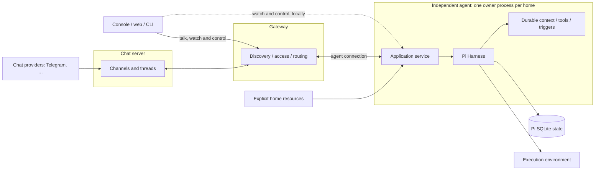

# 🦐 The three programs and what each owns

This is one piece of the design. The words for a decision's status, such as Confirmed or Open, are explained in the [plan](../PLAN.md#the-design).

An agent owns one home and its private work, the chat server owns the shared record of what was said, and the gateway owns who is on the network and how to reach them. They share only contracts.

**The design**

The host builds the model and credential runtime, the trusted durable registry, the environment resolver, SQLite storage and the service, then supervises them. Opening a home's storage changes it, because durable resets unfinished work on every open. The phase 0 spike saw a second process that only opened a live home flip the owner's running turn back to pending, and a second owner send a model request twice and corrupt the first owner's session. So only the owner ever opens a home's storage, and commands that read a home's sessions go through the owner's API. The owner takes an exclusive lock on the home before anything that writes or serves, meaning opening storage, starting servers or binding sockets, and holds it for its lifetime. Reading the home's files comes first, so a home that doesn't load or names an unusable model fails without claiming it. The spike's 21-line lock on `node:sqlite` works on macOS; Linux is qualified with the pieces that cross machines.

Pi owns submissions, `InboxDoc`, `LiveDoc`, `UsageDoc`, conversation entries and configuration, generation, tool and compaction tasks, checkpoints, child ownership and structural watches. Shrimpy reads them directly. Query indexes and UI caches are disposable and name their source.

Shrimpy's own documents hold only what Pi lacks: the thread each session belongs to; immutable source and target provenance; context-source evidence; chat and trigger receipts and policy; where the agent stands in chat's feed; and an ID for the records themselves. A reply waiting to be posted isn't among them: the task that follows its event holds it. Thread names and archive state live with the threads on the chat server. They are written through Harness commits. Pi's statuses are never copied into them.

The host gives each session an `ExecutionEnv`. Replayable operations need a stable resource and cwd identity. Extension code is trusted host code and can bypass the environment, and process cleanup is a separate guarantee from containment.

- **Unsafe by default.** Every built-in durable tool is unsafe; writes, edits, shell commands and unqualified sends stay that way. A custom `safe` declaration needs a stable target and proven deduplication by task or call ID. Deduplicating accepted sends still isn't exactly-once delivery, so uncertain results stay visible.
- **Ownership.** Foreground ownership controls joins and abort; background ownership is explicit. A client disconnect, navigation or cancelled wait never aborts accepted work. Abort reports done only after cancellation settles. Controls never hold a transaction while waiting on their own running turn.
- **Supervision.** Shutdown is bounded and accounts for tool descendants. Cooperative abort kills owned process groups, but killing the owner can leave detached processes running. Prove cleanup with a delayed-write child under the chosen supervisor before advertising it. If that can't be guaranteed, show possible continuing effects and flag the limit for review.
- **Storage.** SQLite in WAL/NORMAL mode survives process crashes, not power loss. Back up from stopped snapshots that include the WAL. Pin Pi's package and task contracts. Before opening admission, the host checks extensions and pending task definitions and names affected sessions on failure, because Pi alone may drop a missing extension or block single tasks. The host installs Shrimpy's extensions after it opens storage and before it resumes work, since what posts to chat is made from the ID of the records. Pi advises installing before the open so recovered work can resume at once; here nothing runs until the host resumes, and this check runs after the install. Upgrading pending work needs compatible definitions or a reviewed disposition.
- Keep the durable, AI, Chord, server, client and protocol packages pinned at `1.0.0`, and pin `pi-tui` the same way when the terminal client arrives. Use public exports only.

The gateway handles discovery, access and routing between clients, agents and the chat server. It keeps the roster, with each member's name and how it is recognized, and the workspace context. It never holds agent homes, Pi storage, execution or conversations, and it reaches agents' sessions only through their API. Losing the gateway pauses chat and remote access but never stops an agent. Watching and controlling an agent on its own machine works without a gateway; talking needs the gateway and the chat server, and on a single machine both run locally.

**Decisions**

| Topic | Today | Proposed | Decision |
|---|---|---|---|
| Stopping and cancelling | — | Service stop halts execution and keeps records; restart follows the [recovery](4-conversation.md) rules. Cancelling work is a separate action, scoped to one session or the whole home, and the three controls are labelled so they can't be confused. Shutdown stops taking new work, gives running turns a short timeout to finish, then pauses the rest; `--now` skips the wait. | Confirmed |
| `shrimpy up` and what it started | — | It stops everything it started when any one of them ends, an agent or the gateway. Closing the terminal leaves the programs running. | Confirmed. Programs started on their own, with `agent serve`, `gateway serve` and `chat serve`, don't share a fate: losing the gateway never stops such an agent. |
| A copied home | — | A home copied with its token was the same agent twice: two live connections with one member, and nothing chose between them. | Changed, and built on 2026-10-04. An agent has one live body. While it runs, the gateway turns away a program that joins with its token, signs in with it under another name or registers as it, and renames nothing. The gateway says what happened; the agent, which knows its home, says how to make a copy an agent of its own, once, while it keeps trying. A copy takes the agent's place once the first one stops, since a copied token is the same agent. |

**Open**

Qualifying the programs and their locks on Linux is under Not built yet in [the network](6-network.md).
